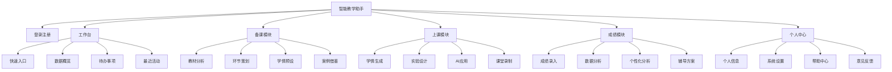
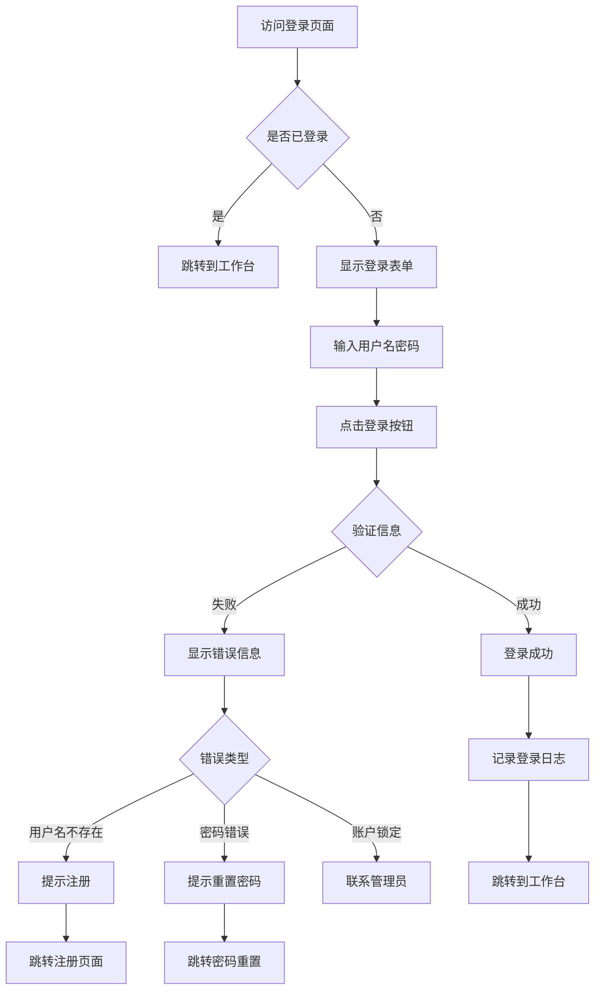
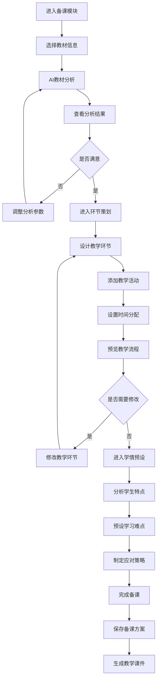
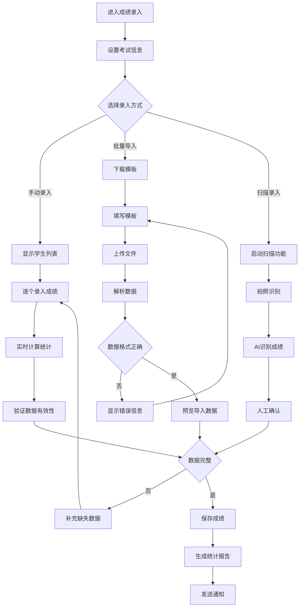

# 智能教学助手原型设计文档

## 1. 原型设计概述

### 1.1 设计目标

本原型设计文档旨在为智能教学助手提供详细的界面原型和交互流程设计，确保产品能够满足教师、学生和家长的核心需求，提供直观、高效的用户体验。

### 1.2 设计原则

#### 教育导向
- **功能优先**：突出教学核心功能，简化非关键操作
- **学习路径清晰**：提供明确的操作指引和学习路径
- **数据驱动**：基于教学数据提供智能化建议

#### 用户体验
- **简洁直观**：界面布局清晰，操作逻辑简单
- **响应迅速**：快速响应用户操作，提供及时反馈
- **个性化**：根据用户角色和偏好定制界面

### 1.3 目标用户

#### 主要用户
- **教师**：备课、上课、成绩管理的主要使用者
- **学生**：查看成绩、获取学习建议的使用者
- **家长**：了解孩子学习情况的使用者

#### 使用场景
- **课前准备**：教材分析、教学设计、资源准备
- **课堂教学**：实时互动、学情分析、内容展示
- **课后管理**：成绩录入、数据分析、辅导方案

## 2. 信息架构

### 2.1 整体架构



### 2.2 导航结构

#### 主导航
```yaml
顶部导航:
  - 工作台: /dashboard
  - 备课: /prepare
  - 上课: /teaching
  - 成绩: /grades
  - 个人中心: /profile

快速操作:
  - 新建课程
  - 录入成绩
  - 查看报告
  - 消息通知
```

#### 侧边导航（模块内）
```yaml
备课模块:
  - 教材分析: /prepare/analysis
  - 环节策划: /prepare/planning
  - 学情预设: /prepare/prediction
  - 案例借鉴: /prepare/cases

上课模块:
  - 学情生成: /teaching/analytics
  - 实验设计: /teaching/experiment
  - AI应用: /teaching/ai-tools
  - 课堂录制: /teaching/recording

成绩模块:
  - 成绩录入: /grades/input
  - 数据分析: /grades/analysis
  - 个性化分析: /grades/personalized
  - 辅导方案: /grades/tutoring
```

## 3. 核心页面原型

### 3.1 登录注册页面

#### 登录页面布局
```html
<!DOCTYPE html>
<html>
<head>
    <title>智能教学助手 - 登录</title>
</head>
<body>
    <div class="login-container">
        <!-- 左侧品牌区域 -->
        <div class="brand-section">
            <div class="brand-logo">
                
                <h1>智能教学助手</h1>
                <p>让教学更智能，让学习更高效</p>
            </div>
            <div class="feature-highlights">
                <div class="feature-item">
                    <i class="icon-ai"></i>
                    <span>AI智能分析</span>
                </div>
                <div class="feature-item">
                    <i class="icon-chart"></i>
                    <span>数据可视化</span>
                </div>
                <div class="feature-item">
                    <i class="icon-mobile"></i>
                    <span>多端同步</span>
                </div>
            </div>
        </div>
        
        <!-- 右侧登录表单 -->
        <div class="login-form-section">
            <div class="form-container">
                <h2>欢迎回来</h2>
                <p class="form-subtitle">请登录您的账户</p>
                
                <form class="login-form">
                    <div class="form-group">
                        <label for="username">用户名/邮箱</label>
                        <input type="text" id="username" placeholder="请输入用户名或邮箱">
                    </div>
                    
                    <div class="form-group">
                        <label for="password">密码</label>
                        <input type="password" id="password" placeholder="请输入密码">
                        <button type="button" class="password-toggle">
                            <i class="icon-eye"></i>
                        </button>
                    </div>
                    
                    <div class="form-options">
                        <label class="checkbox">
                            <input type="checkbox" id="remember">
                            <span>记住我</span>
                        </label>
                        <a href="/forgot-password" class="forgot-link">忘记密码？</a>
                    </div>
                    
                    <button type="submit" class="btn btn-primary btn-block">登录</button>
                </form>
                
                <div class="divider">
                    <span>或</span>
                </div>
                
                <div class="social-login">
                    <button class="btn btn-social btn-wechat">
                        <i class="icon-wechat"></i>
                        微信登录
                    </button>
                    <button class="btn btn-social btn-qq">
                        <i class="icon-qq"></i>
                        QQ登录
                    </button>
                </div>
                
                <p class="register-link">
                    还没有账户？<a href="/register">立即注册</a>
                </p>
            </div>
        </div>
    </div>
</body>
</html>
```

#### 注册页面流程
```yaml
注册步骤:
  步骤1 - 基本信息:
    - 用户名
    - 邮箱
    - 密码
    - 确认密码
    - 用户类型（教师/学生/家长）
  
  步骤2 - 详细信息:
    教师:
      - 真实姓名
      - 学校名称
      - 任教科目
      - 教学年级
    学生:
      - 真实姓名
      - 学校名称
      - 年级班级
      - 学号
    家长:
      - 真实姓名
      - 联系电话
      - 孩子信息
  
  步骤3 - 验证激活:
    - 邮箱验证
    - 手机验证（可选）
    - 完成注册
```

### 3.2 工作台页面

#### 工作台布局
```html
<div class="dashboard-container">
    <!-- 顶部导航 -->
    <header class="dashboard-header">
        <div class="header-left">
            <div class="logo">
                
                <span>智能教学助手</span>
            </div>
        </div>
        
        <nav class="main-nav">
            <a href="/dashboard" class="nav-item active">工作台</a>
            <a href="/prepare" class="nav-item">备课</a>
            <a href="/teaching" class="nav-item">上课</a>
            <a href="/grades" class="nav-item">成绩</a>
        </nav>
        
        <div class="header-right">
            <button class="btn btn-primary">新建课程</button>
            <div class="notification-icon">
                <i class="icon-bell"></i>
                <span class="badge">3</span>
            </div>
            <div class="user-menu">
                
                <span class="username">张老师</span>
                <i class="icon-chevron-down"></i>
            </div>
        </div>
    </header>
    
    <!-- 主要内容区域 -->
    <main class="dashboard-main">
        <!-- 快速操作区域 -->
        <section class="quick-actions">
            <h2>快速操作</h2>
            <div class="action-grid">
                <div class="action-card">
                    <div class="action-icon">
                        <i class="icon-book"></i>
                    </div>
                    <h3>备课助手</h3>
                    <p>AI智能分析教材，生成教学方案</p>
                    <button class="btn btn-outline">开始备课</button>
                </div>
                
                <div class="action-card">
                    <div class="action-icon">
                        <i class="icon-chart-bar"></i>
                    </div>
                    <h3>成绩录入</h3>
                    <p>快速录入学生成绩，自动生成分析</p>
                    <button class="btn btn-outline">录入成绩</button>
                </div>
                
                <div class="action-card">
                    <div class="action-icon">
                        <i class="icon-users"></i>
                    </div>
                    <h3>班级管理</h3>
                    <p>管理班级信息，查看学生动态</p>
                    <button class="btn btn-outline">管理班级</button>
                </div>
                
                <div class="action-card">
                    <div class="action-icon">
                        <i class="icon-lightbulb"></i>
                    </div>
                    <h3>AI助教</h3>
                    <p>智能问答，教学建议和资源推荐</p>
                    <button class="btn btn-outline">咨询助教</button>
                </div>
            </div>
        </section>
        
        <!-- 数据概览区域 -->
        <section class="data-overview">
            <h2>数据概览</h2>
            <div class="overview-grid">
                <div class="overview-card">
                    <div class="card-header">
                        <h3>本周课程</h3>
                        <i class="icon-calendar"></i>
                    </div>
                    <div class="card-content">
                        <div class="metric-value">12</div>
                        <div class="metric-label">节课</div>
                        <div class="metric-change positive">
                            <i class="icon-arrow-up"></i>
                            <span>+2</span>
                        </div>
                    </div>
                </div>
                
                <div class="overview-card">
                    <div class="card-header">
                        <h3>班级平均分</h3>
                        <i class="icon-chart-line"></i>
                    </div>
                    <div class="card-content">
                        <div class="metric-value">85.6</div>
                        <div class="metric-label">分</div>
                        <div class="metric-change positive">
                            <i class="icon-arrow-up"></i>
                            <span>+3.2</span>
                        </div>
                    </div>
                </div>
                
                <div class="overview-card">
                    <div class="card-header">
                        <h3>学生参与度</h3>
                        <i class="icon-users"></i>
                    </div>
                    <div class="card-content">
                        <div class="metric-value">92%</div>
                        <div class="metric-label">参与率</div>
                        <div class="metric-change positive">
                            <i class="icon-arrow-up"></i>
                            <span>+5%</span>
                        </div>
                    </div>
                </div>
                
                <div class="overview-card">
                    <div class="card-header">
                        <h3>待批改作业</h3>
                        <i class="icon-clipboard"></i>
                    </div>
                    <div class="card-content">
                        <div class="metric-value">8</div>
                        <div class="metric-label">份</div>
                        <div class="metric-change neutral">
                            <span>待处理</span>
                        </div>
                    </div>
                </div>
            </div>
        </section>
        
        <!-- 内容区域 -->
        <div class="dashboard-content">
            <!-- 左侧内容 -->
            <div class="content-left">
                <!-- 最近课程 -->
                <section class="recent-courses">
                    <div class="section-header">
                        <h3>最近课程</h3>
                        <a href="/courses" class="view-all">查看全部</a>
                    </div>
                    <div class="course-list">
                        <div class="course-item">
                            <div class="course-info">
                                <h4>高中生物 - 细胞结构</h4>
                                <p>高一(3)班 • 2024-01-15 14:30</p>
                            </div>
                            <div class="course-status">
                                <span class="status-badge completed">已完成</span>
                            </div>
                            <div class="course-actions">
                                <button class="btn btn-sm btn-outline">查看详情</button>
                            </div>
                        </div>
                        
                        <div class="course-item">
                            <div class="course-info">
                                <h4>高中生物 - 遗传规律</h4>
                                <p>高一(2)班 • 2024-01-16 10:00</p>
                            </div>
                            <div class="course-status">
                                <span class="status-badge upcoming">即将开始</span>
                            </div>
                            <div class="course-actions">
                                <button class="btn btn-sm btn-primary">开始上课</button>
                            </div>
                        </div>
                        
                        <div class="course-item">
                            <div class="course-info">
                                <h4>高中生物 - 生态系统</h4>
                                <p>高一(1)班 • 2024-01-17 09:00</p>
                            </div>
                            <div class="course-status">
                                <span class="status-badge preparing">备课中</span>
                            </div>
                            <div class="course-actions">
                                <button class="btn btn-sm btn-outline">继续备课</button>
                            </div>
                        </div>
                    </div>
                </section>
                
                <!-- 成绩趋势 -->
                <section class="grade-trends">
                    <div class="section-header">
                        <h3>成绩趋势</h3>
                        <div class="chart-controls">
                            <select class="form-select">
                                <option>高一(1)班</option>
                                <option>高一(2)班</option>
                                <option>高一(3)班</option>
                            </select>
                        </div>
                    </div>
                    <div class="chart-container">
                        <canvas id="gradeChart" width="400" height="200"></canvas>
                    </div>
                </section>
            </div>
            
            <!-- 右侧内容 -->
            <div class="content-right">
                <!-- 待办事项 -->
                <section class="todo-list">
                    <div class="section-header">
                        <h3>待办事项</h3>
                        <button class="btn btn-sm btn-outline">添加</button>
                    </div>
                    <div class="todo-items">
                        <div class="todo-item">
                            <div class="todo-checkbox">
                                <input type="checkbox" id="todo1">
                                <label for="todo1"></label>
                            </div>
                            <div class="todo-content">
                                <h4>批改高一(2)班作业</h4>
                                <p>截止时间：今天 18:00</p>
                            </div>
                            <div class="todo-priority high"></div>
                        </div>
                        
                        <div class="todo-item">
                            <div class="todo-checkbox">
                                <input type="checkbox" id="todo2">
                                <label for="todo2"></label>
                            </div>
                            <div class="todo-content">
                                <h4>准备明天的实验材料</h4>
                                <p>截止时间：明天 08:00</p>
                            </div>
                            <div class="todo-priority medium"></div>
                        </div>
                        
                        <div class="todo-item completed">
                            <div class="todo-checkbox">
                                <input type="checkbox" id="todo3" checked>
                                <label for="todo3"></label>
                            </div>
                            <div class="todo-content">
                                <h4>更新教学计划</h4>
                                <p>已完成</p>
                            </div>
                            <div class="todo-priority low"></div>
                        </div>
                    </div>
                </section>
                
                <!-- 消息通知 -->
                <section class="notifications">
                    <div class="section-header">
                        <h3>消息通知</h3>
                        <a href="/notifications" class="view-all">查看全部</a>
                    </div>
                    <div class="notification-items">
                        <div class="notification-item unread">
                            <div class="notification-icon">
                                <i class="icon-user"></i>
                            </div>
                            <div class="notification-content">
                                <h4>学生提问</h4>
                                <p>李小明对"细胞分裂"有疑问</p>
                                <span class="time">5分钟前</span>
                            </div>
                        </div>
                        
                        <div class="notification-item">
                            <div class="notification-icon">
                                <i class="icon-chart"></i>
                            </div>
                            <div class="notification-content">
                                <h4>成绩分析报告</h4>
                                <p>高一(3)班月考分析已生成</p>
                                <span class="time">1小时前</span>
                            </div>
                        </div>
                        
                        <div class="notification-item">
                            <div class="notification-icon">
                                <i class="icon-calendar"></i>
                            </div>
                            <div class="notification-content">
                                <h4>课程提醒</h4>
                                <p>明天上午有3节课需要准备</p>
                                <span class="time">3小时前</span>
                            </div>
                        </div>
                    </div>
                </section>
                
                <!-- AI助教建议 -->
                <section class="ai-suggestions">
                    <div class="section-header">
                        <h3>AI助教建议</h3>
                        <i class="icon-robot"></i>
                    </div>
                    <div class="suggestion-items">
                        <div class="suggestion-item">
                            <div class="suggestion-icon">
                                <i class="icon-lightbulb"></i>
                            </div>
                            <div class="suggestion-content">
                                <h4>教学建议</h4>
                                <p>根据学生表现，建议在"遗传规律"章节增加实例讲解</p>
                            </div>
                        </div>
                        
                        <div class="suggestion-item">
                            <div class="suggestion-icon">
                                <i class="icon-chart-bar"></i>
                            </div>
                            <div class="suggestion-content">
                                <h4>数据洞察</h4>
                                <p>高一(2)班在"细胞结构"知识点掌握较弱，建议重点复习</p>
                            </div>
                        </div>
                    </div>
                </section>
            </div>
        </div>
    </main>
</div>
```

### 3.3 备课模块页面

#### 教材分析页面
```html
<div class="prepare-container">
    <!-- 侧边导航 -->
    <aside class="prepare-sidebar">
        <nav class="sidebar-nav">
            <a href="/prepare/analysis" class="nav-item active">
                <i class="icon-search"></i>
                <span>教材分析</span>
            </a>
            <a href="/prepare/planning" class="nav-item">
                <i class="icon-list"></i>
                <span>环节策划</span>
            </a>
            <a href="/prepare/prediction" class="nav-item">
                <i class="icon-users"></i>
                <span>学情预设</span>
            </a>
            <a href="/prepare/cases" class="nav-item">
                <i class="icon-star"></i>
                <span>案例借鉴</span>
            </a>
        </nav>
    </aside>
    
    <!-- 主要内容 -->
    <main class="prepare-main">
        <div class="page-header">
            <h1>教材分析</h1>
            <p>AI智能分析教材内容，提供教学重点和难点建议</p>
        </div>
        
        <!-- 教材选择区域 -->
        <section class="material-selection">
            <div class="selection-form">
                <div class="form-row">
                    <div class="form-group">
                        <label>学科</label>
                        <select class="form-select">
                            <option>生物</option>
                            <option>化学</option>
                            <option>物理</option>
                        </select>
                    </div>
                    
                    <div class="form-group">
                        <label>年级</label>
                        <select class="form-select">
                            <option>高一</option>
                            <option>高二</option>
                            <option>高三</option>
                        </select>
                    </div>
                    
                    <div class="form-group">
                        <label>教材版本</label>
                        <select class="form-select">
                            <option>人教版</option>
                            <option>苏教版</option>
                            <option>北师大版</option>
                        </select>
                    </div>
                    
                    <div class="form-group">
                        <label>章节</label>
                        <select class="form-select">
                            <option>第一章 细胞的分子组成</option>
                            <option>第二章 细胞的结构</option>
                            <option>第三章 细胞的代谢</option>
                        </select>
                    </div>
                </div>
                
                <div class="form-actions">
                    <button class="btn btn-primary">
                        <i class="icon-magic"></i>
                        开始AI分析
                    </button>
                    <button class="btn btn-outline">
                        <i class="icon-upload"></i>
                        上传自定义教材
                    </button>
                </div>
            </div>
        </section>
        
        <!-- 分析结果区域 -->
        <section class="analysis-results">
            <div class="results-header">
                <h2>分析结果</h2>
                <div class="analysis-status">
                    <span class="status-badge success">分析完成</span>
                    <span class="analysis-time">分析用时：2.3秒</span>
                </div>
            </div>
            
            <div class="results-content">
                <!-- 知识点结构 -->
                <div class="result-card">
                    <div class="card-header">
                        <h3>知识点结构</h3>
                        <button class="btn btn-sm btn-outline">导出</button>
                    </div>
                    <div class="card-content">
                        <div class="knowledge-tree">
                            <div class="tree-node expanded">
                                <div class="node-content">
                                    <i class="icon-folder-open"></i>
                                    <span>细胞的结构</span>
                                    <span class="difficulty-badge high">重点</span>
                                </div>
                                <div class="node-children">
                                    <div class="tree-node">
                                        <div class="node-content">
                                            <i class="icon-file"></i>
                                            <span>细胞膜的结构与功能</span>
                                            <span class="difficulty-badge medium">难点</span>
                                        </div>
                                    </div>
                                    <div class="tree-node">
                                        <div class="node-content">
                                            <i class="icon-file"></i>
                                            <span>细胞核的结构与功能</span>
                                            <span class="difficulty-badge low">基础</span>
                                        </div>
                                    </div>
                                    <div class="tree-node">
                                        <div class="node-content">
                                            <i class="icon-file"></i>
                                            <span>细胞质的结构与功能</span>
                                            <span class="difficulty-badge medium">重点</span>
                                        </div>
                                    </div>
                                </div>
                            </div>
                        </div>
                    </div>
                </div>
                
                <!-- 教学重点 -->
                <div class="result-card">
                    <div class="card-header">
                        <h3>教学重点</h3>
                        <span class="point-count">3个重点</span>
                    </div>
                    <div class="card-content">
                        <div class="point-list">
                            <div class="point-item">
                                <div class="point-marker high"></div>
                                <div class="point-content">
                                    <h4>细胞膜的流动镶嵌模型</h4>
                                    <p>理解细胞膜的分子结构，掌握流动性和选择透过性的机理</p>
                                    <div class="point-tags">
                                        <span class="tag">概念理解</span>
                                        <span class="tag">模型建构</span>
                                    </div>
                                </div>
                            </div>
                            
                            <div class="point-item">
                                <div class="point-marker high"></div>
                                <div class="point-content">
                                    <h4>细胞核的功能</h4>
                                    <p>理解细胞核作为遗传信息库和细胞代谢调控中心的作用</p>
                                    <div class="point-tags">
                                        <span class="tag">功能分析</span>
                                        <span class="tag">实验验证</span>
                                    </div>
                                </div>
                            </div>
                            
                            <div class="point-item">
                                <div class="point-marker medium"></div>
                                <div class="point-content">
                                    <h4>细胞器的协调配合</h4>
                                    <p>理解各种细胞器在细胞生命活动中的协调配合关系</p>
                                    <div class="point-tags">
                                        <span class="tag">系统思维</span>
                                        <span class="tag">综合分析</span>
                                    </div>
                                </div>
                            </div>
                        </div>
                    </div>
                </div>
                
                <!-- 教学难点 -->
                <div class="result-card">
                    <div class="card-header">
                        <h3>教学难点</h3>
                        <span class="point-count">2个难点</span>
                    </div>
                    <div class="card-content">
                        <div class="difficulty-list">
                            <div class="difficulty-item">
                                <div class="difficulty-header">
                                    <h4>生物膜的流动性机理</h4>
                                    <span class="difficulty-level high">高难度</span>
                                </div>
                                <div class="difficulty-content">
                                    <p><strong>难点分析：</strong>学生难以理解分子水平的动态变化过程</p>
                                    <p><strong>突破建议：</strong></p>
                                    <ul>
                                        <li>使用动画演示磷脂分子的运动</li>
                                        <li>结合温度对膜流动性的影响实验</li>
                                        <li>类比生活中的流动现象</li>
                                    </ul>
                                </div>
                            </div>
                            
                            <div class="difficulty-item">
                                <div class="difficulty-header">
                                    <h4>载体蛋白的工作机理</h4>
                                    <span class="difficulty-level medium">中难度</span>
                                </div>
                                <div class="difficulty-content">
                                    <p><strong>难点分析：</strong>载体蛋白构象变化的分子机理较为抽象</p>
                                    <p><strong>突破建议：</strong></p>
                                    <ul>
                                        <li>使用3D模型展示蛋白质构象变化</li>
                                        <li>设计载体蛋白功能的模拟实验</li>
                                        <li>对比不同载体蛋白的特异性</li>
                                    </ul>
                                </div>
                            </div>
                        </div>
                    </div>
                </div>
                
                <!-- 教学建议 -->
                <div class="result-card">
                    <div class="card-header">
                        <h3>AI教学建议</h3>
                        <i class="icon-robot"></i>
                    </div>
                    <div class="card-content">
                        <div class="suggestion-list">
                            <div class="suggestion-item">
                                <div class="suggestion-icon">
                                    <i class="icon-clock"></i>
                                </div>
                                <div class="suggestion-content">
                                    <h4>课时安排建议</h4>
                                    <p>建议安排2-3课时，第一课时重点讲解细胞膜结构，第二课时讲解细胞核和细胞质，第三课时进行综合复习</p>
                                </div>
                            </div>
                            
                            <div class="suggestion-item">
                                <div class="suggestion-icon">
                                    <i class="icon-experiment"></i>
                                </div>
                                <div class="suggestion-content">
                                    <h4>实验设计建议</h4>
                                    <p>推荐进行"观察细胞的亚显微结构"实验，使用电镜照片对比不同细胞器的形态特征</p>
                                </div>
                            </div>
                            
                            <div class="suggestion-item">
                                <div class="suggestion-icon">
                                    <i class="icon-question"></i>
                                </div>
                                <div class="suggestion-content">
                                    <h4>问题设计建议</h4>
                                    <p>设计递进式问题：细胞膜为什么具有选择透过性？→载体蛋白如何实现选择性运输？→细胞如何调节物质运输？</p>
                                </div>
                            </div>
                        </div>
                    </div>
                </div>
            </div>
        </section>
        
        <!-- 操作区域 -->
        <section class="action-section">
            <div class="action-buttons">
                <button class="btn btn-primary">
                    <i class="icon-arrow-right"></i>
                    进入环节策划
                </button>
                <button class="btn btn-outline">
                    <i class="icon-save"></i>
                    保存分析结果
                </button>
                <button class="btn btn-outline">
                    <i class="icon-share"></i>
                    分享给同事
                </button>
                <button class="btn btn-outline">
                    <i class="icon-download"></i>
                    导出PDF
                </button>
            </div>
        </section>
    </main>
</div>
```

### 3.4 成绩模块页面

#### 成绩录入页面
```html
<div class="grades-container">
    <!-- 侧边导航 -->
    <aside class="grades-sidebar">
        <nav class="sidebar-nav">
            <a href="/grades/input" class="nav-item active">
                <i class="icon-edit"></i>
                <span>成绩录入</span>
            </a>
            <a href="/grades/analysis" class="nav-item">
                <i class="icon-chart-bar"></i>
                <span>数据分析</span>
            </a>
            <a href="/grades/personalized" class="nav-item">
                <i class="icon-user"></i>
                <span>个性化分析</span>
            </a>
            <a href="/grades/tutoring" class="nav-item">
                <i class="icon-lightbulb"></i>
                <span>辅导方案</span>
            </a>
        </nav>
    </aside>
    
    <!-- 主要内容 -->
    <main class="grades-main">
        <div class="page-header">
            <h1>成绩录入</h1>
            <p>快速录入学生成绩，支持批量导入和手动录入</p>
        </div>
        
        <!-- 录入方式选择 -->
        <section class="input-method-selection">
            <div class="method-tabs">
                <button class="tab-button active" data-tab="manual">
                    <i class="icon-edit"></i>
                    <span>手动录入</span>
                </button>
                <button class="tab-button" data-tab="batch">
                    <i class="icon-upload"></i>
                    <span>批量导入</span>
                </button>
                <button class="tab-button" data-tab="scan">
                    <i class="icon-camera"></i>
                    <span>扫描录入</span>
                </button>
            </div>
        </section>
        
        <!-- 考试信息设置 -->
        <section class="exam-info">
            <div class="info-form">
                <div class="form-row">
                    <div class="form-group">
                        <label>考试名称</label>
                        <input type="text" class="form-control" placeholder="例如：第一次月考">
                    </div>
                    
                    <div class="form-group">
                        <label>考试科目</label>
                        <select class="form-select">
                            <option>生物</option>
                            <option>化学</option>
                            <option>物理</option>
                        </select>
                    </div>
                    
                    <div class="form-group">
                        <label>考试班级</label>
                        <select class="form-select">
                            <option>高一(1)班</option>
                            <option>高一(2)班</option>
                            <option>高一(3)班</option>
                        </select>
                    </div>
                    
                    <div class="form-group">
                        <label>考试日期</label>
                        <input type="date" class="form-control">
                    </div>
                </div>
                
                <div class="form-row">
                    <div class="form-group">
                        <label>总分</label>
                        <input type="number" class="form-control" value="100" min="1">
                    </div>
                    
                    <div class="form-group">
                        <label>及格分</label>
                        <input type="number" class="form-control" value="60" min="1">
                    </div>
                    
                    <div class="form-group">
                        <label>考试类型</label>
                        <select class="form-select">
                            <option>月考</option>
                            <option>期中考试</option>
                            <option>期末考试</option>
                            <option>单元测试</option>
                        </select>
                    </div>
                    
                    <div class="form-group">
                        <label>权重</label>
                        <select class="form-select">
                            <option>1.0（正常）</option>
                            <option>1.5（重要）</option>
                            <option>2.0（非常重要）</option>
                        </select>
                    </div>
                </div>
            </div>
        </section>
        
        <!-- 手动录入内容 -->
        <section class="manual-input" id="manual-tab">
            <div class="input-header">
                <h3>学生成绩录入</h3>
                <div class="header-actions">
                    <button class="btn btn-outline btn-sm">
                        <i class="icon-plus"></i>
                        添加学生
                    </button>
                    <button class="btn btn-outline btn-sm">
                        <i class="icon-sort"></i>
                        排序
                    </button>
                    <button class="btn btn-outline btn-sm">
                        <i class="icon-filter"></i>
                        筛选
                    </button>
                </div>
            </div>
            
            <div class="grades-table-container">
                <table class="grades-table">
                    <thead>
                        <tr>
                            <th width="60">
                                <input type="checkbox" id="selectAll">
                            </th>
                            <th width="80">学号</th>
                            <th width="120">姓名</th>
                            <th width="100">成绩</th>
                            <th width="100">等级</th>
                            <th width="120">排名</th>
                            <th width="150">备注</th>
                            <th width="100">操作</th>
                        </tr>
                    </thead>
                    <tbody>
                        <tr class="grade-row">
                            <td>
                                <input type="checkbox" class="row-checkbox">
                            </td>
                            <td>001</td>
                            <td>
                                <div class="student-info">
                                    
                                    <span>张小明</span>
                                </div>
                            </td>
                            <td>
                                <input type="number" class="grade-input" placeholder="0-100" min="0" max="100">
                            </td>
                            <td>
                                <span class="grade-level">-</span>
                            </td>
                            <td>
                                <span class="grade-rank">-</span>
                            </td>
                            <td>
                                <input type="text" class="remark-input" placeholder="备注">
                            </td>
                            <td>
                                <button class="btn btn-sm btn-outline">
                                    <i class="icon-eye"></i>
                                </button>
                            </td>
                        </tr>
                        
                        <tr class="grade-row">
                            <td>
                                <input type="checkbox" class="row-checkbox">
                            </td>
                            <td>002</td>
                            <td>
                                <div class="student-info">
                                    
                                    <span>李小红</span>
                                </div>
                            </td>
                            <td>
                                <input type="number" class="grade-input" value="85" min="0" max="100">
                            </td>
                            <td>
                                <span class="grade-level good">良好</span>
                            </td>
                            <td>
                                <span class="grade-rank">12</span>
                            </td>
                            <td>
                                <input type="text" class="remark-input" value="进步明显">
                            </td>
                            <td>
                                <button class="btn btn-sm btn-outline">
                                    <i class="icon-eye"></i>
                                </button>
                            </td>
                        </tr>
                        
                        <tr class="grade-row">
                            <td>
                                <input type="checkbox" class="row-checkbox">
                            </td>
                            <td>003</td>
                            <td>
                                <div class="student-info">
                                    
                                    <span>王小强</span>
                                </div>
                            </td>
                            <td>
                                <input type="number" class="grade-input" value="92" min="0" max="100">
                            </td>
                            <td>
                                <span class="grade-level excellent">优秀</span>
                            </td>
                            <td>
                                <span class="grade-rank">3</span>
                            </td>
                            <td>
                                <input type="text" class="remark-input" value="表现优异">
                            </td>
                            <td>
                                <button class="btn btn-sm btn-outline">
                                    <i class="icon-eye"></i>
                                </button>
                            </td>
                        </tr>
                    </tbody>
                </table>
            </div>
            
            <!-- 统计信息 -->
            <div class="statistics-panel">
                <div class="stat-item">
                    <label>已录入</label>
                    <span class="stat-value">2/45</span>
                </div>
                <div class="stat-item">
                    <label>平均分</label>
                    <span class="stat-value">88.5</span>
                </div>
                <div class="stat-item">
                    <label>最高分</label>
                    <span class="stat-value">92</span>
                </div>
                <div class="stat-item">
                    <label>最低分</label>
                    <span class="stat-value">85</span>
                </div>
                <div class="stat-item">
                    <label>及格率</label>
                    <span class="stat-value">100%</span>
                </div>
            </div>
        </section>
        
        <!-- 批量导入内容 -->
        <section class="batch-import" id="batch-tab" style="display: none;">
            <div class="import-steps">
                <div class="step-item active">
                    <div class="step-number">1</div>
                    <div class="step-content">
                        <h4>下载模板</h4>
                        <p>下载标准Excel模板</p>
                    </div>
                </div>
                
                <div class="step-item">
                    <div class="step-number">2</div>
                    <div class="step-content">
                        <h4>填写数据</h4>
                        <p>按模板格式填写成绩</p>
                    </div>
                </div>
                
                <div class="step-item">
                    <div class="step-number">3</div>
                    <div class="step-content">
                        <h4>上传文件</h4>
                        <p>上传填写好的Excel文件</p>
                    </div>
                </div>
                
                <div class="step-item">
                    <div class="step-number">4</div>
                    <div class="step-content">
                        <h4>确认导入</h4>
                        <p>检查数据并确认导入</p>
                    </div>
                </div>
            </div>
            
            <div class="import-content">
                <div class="template-download">
                    <h3>第一步：下载模板</h3>
                    <p>请先下载标准模板，按照模板格式填写学生成绩数据</p>
                    <button class="btn btn-primary">
                        <i class="icon-download"></i>
                        下载Excel模板
                    </button>
                </div>
                
                <div class="file-upload">
                    <h3>第二步：上传文件</h3>
                    <div class="upload-area">
                        <div class="upload-icon">
                            <i class="icon-cloud-upload"></i>
                        </div>
                        <p>拖拽Excel文件到此处，或点击选择文件</p>
                        <p class="upload-hint">支持.xlsx、.xls格式，文件大小不超过10MB</p>
                        <button class="btn btn-outline">选择文件</button>
                    </div>
                </div>
            </div>
        </section>
        
        <!-- 操作按钮 -->
        <section class="action-section">
            <div class="action-buttons">
                <button class="btn btn-primary">
                    <i class="icon-save"></i>
                    保存成绩
                </button>
                <button class="btn btn-success">
                    <i class="icon-check"></i>
                    提交审核
                </button>
                <button class="btn btn-outline">
                    <i class="icon-chart"></i>
                    生成分析报告
                </button>
                <button class="btn btn-outline">
                    <i class="icon-share"></i>
                    分享给家长
                </button>
            </div>
        </section>
    </main>
</div>
```

## 4. 交互流程设计

### 4.1 用户登录流程



### 4.2 备课流程



### 4.3 成绩录入流程



## 5. 响应式设计

### 5.1 断点设计

```scss
// 断点定义
$breakpoints: (
  xs: 0,
  sm: 576px,
  md: 768px,
  lg: 992px,
  xl: 1200px,
  xxl: 1400px
);

// 移动端优先的媒体查询
@mixin respond-above($breakpoint) {
  @if map-has-key($breakpoints, $breakpoint) {
    $breakpoint-value: map-get($breakpoints, $breakpoint);
    @media (min-width: $breakpoint-value) {
      @content;
    }
  }
}

@mixin respond-below($breakpoint) {
  @if map-has-key($breakpoints, $breakpoint) {
    $breakpoint-value: map-get($breakpoints, $breakpoint);
    @media (max-width: ($breakpoint-value - 1)) {
      @content;
    }
  }
}
```

### 5.2 布局适配

#### 工作台响应式布局
```scss
.dashboard-container {
  display: flex;
  flex-direction: column;
  min-height: 100vh;
  
  .dashboard-header {
    display: flex;
    align-items: center;
    padding: 0 16px;
    height: 64px;
    background: #fff;
    border-bottom: 1px solid #f0f0f0;
    
    @include respond-below(md) {
      padding: 0 12px;
      height: 56px;
      
      .main-nav {
        display: none;
      }
      
      .header-right {
        .btn {
          display: none;
        }
      }
    }
  }
  
  .dashboard-main {
    flex: 1;
    padding: 24px;
    
    @include respond-below(md) {
      padding: 16px 12px;
    }
    
    .dashboard-content {
      display: grid;
      grid-template-columns: 2fr 1fr;
      gap: 24px;
      margin-top: 24px;
      
      @include respond-below(lg) {
        grid-template-columns: 1fr;
        gap: 16px;
      }
    }
  }
  
  .quick-actions {
    .action-grid {
      display: grid;
      grid-template-columns: repeat(auto-fit, minmax(250px, 1fr));
      gap: 16px;
      
      @include respond-below(sm) {
        grid-template-columns: 1fr;
      }
    }
  }
  
  .data-overview {
    .overview-grid {
      display: grid;
      grid-template-columns: repeat(auto-fit, minmax(200px, 1fr));
      gap: 16px;
      
      @include respond-below(sm) {
        grid-template-columns: repeat(2, 1fr);
      }
    }
  }
}
```

#### 表格响应式设计
```scss
.grades-table-container {
  overflow-x: auto;
  -webkit-overflow-scrolling: touch;
  
  .grades-table {
    min-width: 800px;
    
    @include respond-below(md) {
      min-width: 600px;
      
      th, td {
        padding: 8px 4px;
        font-size: 14px;
      }
      
      .student-avatar {
        width: 24px;
        height: 24px;
      }
    }
    
    @include respond-below(sm) {
      // 在小屏幕上转换为卡片布局
      display: none;
    }
  }
  
  // 移动端卡片布局
  .mobile-grade-cards {
    display: none;
    
    @include respond-below(sm) {
      display: block;
      
      .grade-card {
          background: #fff;
          border: 1px solid #f0f0f0;
          border-radius: 8px;
          padding: 16px;
          margin-bottom: 12px;
          
          .student-header {
            display: flex;
            align-items: center;
            margin-bottom: 12px;
            
            .student-avatar {
              width: 32px;
              height: 32px;
              border-radius: 50%;
              margin-right: 8px;
            }
            
            .student-name {
              font-weight: 500;
              font-size: 16px;
            }
            
            .student-id {
              color: #666;
              font-size: 14px;
              margin-left: auto;
            }
          }
          
          .grade-info {
            display: grid;
            grid-template-columns: 1fr 1fr;
            gap: 12px;
            
            .info-item {
              .label {
                color: #666;
                font-size: 12px;
                margin-bottom: 4px;
              }
              
              .value {
                font-size: 16px;
                font-weight: 500;
              }
            }
          }
        }
      }
    }
  }
}
```

### 5.3 移动端导航

#### 底部标签导航
```scss
.mobile-bottom-nav {
  display: none;
  
  @include respond-below(md) {
    display: flex;
    position: fixed;
    bottom: 0;
    left: 0;
    right: 0;
    background: #fff;
    border-top: 1px solid #f0f0f0;
    padding: 8px 0;
    z-index: 1000;
    
    .nav-item {
      flex: 1;
      display: flex;
      flex-direction: column;
      align-items: center;
      padding: 8px;
      text-decoration: none;
      color: #666;
      transition: color 0.2s;
      
      &.active {
        color: #1890ff;
      }
      
      .nav-icon {
        font-size: 20px;
        margin-bottom: 4px;
      }
      
      .nav-label {
        font-size: 12px;
      }
    }
  }
}
```

#### 移动端侧边抽屉
```scss
.mobile-drawer {
  display: none;
  
  @include respond-below(md) {
    display: block;
    
    .drawer-overlay {
      position: fixed;
      top: 0;
      left: 0;
      right: 0;
      bottom: 0;
      background: rgba(0, 0, 0, 0.5);
      z-index: 1000;
      opacity: 0;
      visibility: hidden;
      transition: all 0.3s;
      
      &.active {
        opacity: 1;
        visibility: visible;
      }
    }
    
    .drawer-content {
      position: fixed;
      top: 0;
      left: 0;
      bottom: 0;
      width: 280px;
      background: #fff;
      z-index: 1001;
      transform: translateX(-100%);
      transition: transform 0.3s;
      
      &.active {
        transform: translateX(0);
      }
      
      .drawer-header {
        padding: 16px;
        border-bottom: 1px solid #f0f0f0;
        
        .user-info {
          display: flex;
          align-items: center;
          
          .avatar {
            width: 40px;
            height: 40px;
            border-radius: 50%;
            margin-right: 12px;
          }
          
          .user-details {
            .username {
              font-weight: 500;
              margin-bottom: 4px;
            }
            
            .user-role {
              color: #666;
              font-size: 14px;
            }
          }
        }
      }
      
      .drawer-nav {
        padding: 16px 0;
        
        .nav-item {
          display: flex;
          align-items: center;
          padding: 12px 16px;
          text-decoration: none;
          color: #333;
          transition: background-color 0.2s;
          
          &:hover {
            background-color: #f5f5f5;
          }
          
          &.active {
            background-color: #e6f7ff;
            color: #1890ff;
          }
          
          .nav-icon {
            width: 20px;
            margin-right: 12px;
          }
          
          .nav-label {
            flex: 1;
          }
        }
      }
    }
  }
}
```

## 6. 组件状态设计

### 6.1 按钮状态

```scss
.btn {
  // 默认状态
  &.btn-primary {
    background-color: #1890ff;
    border-color: #1890ff;
    color: #fff;
    
    // 悬停状态
    &:hover {
      background-color: #40a9ff;
      border-color: #40a9ff;
    }
    
    // 激活状态
    &:active {
      background-color: #096dd9;
      border-color: #096dd9;
    }
    
    // 禁用状态
    &:disabled {
      background-color: #f5f5f5;
      border-color: #d9d9d9;
      color: #bfbfbf;
      cursor: not-allowed;
    }
    
    // 加载状态
    &.loading {
      position: relative;
      color: transparent;
      
      &::after {
        content: '';
        position: absolute;
        top: 50%;
        left: 50%;
        width: 16px;
        height: 16px;
        margin: -8px 0 0 -8px;
        border: 2px solid #fff;
        border-top-color: transparent;
        border-radius: 50%;
        animation: spin 1s linear infinite;
      }
    }
  }
}

@keyframes spin {
  to {
    transform: rotate(360deg);
  }
}
```

### 6.2 表单状态

```scss
.form-control {
  // 默认状态
  border: 1px solid #d9d9d9;
  
  // 聚焦状态
  &:focus {
    border-color: #40a9ff;
    box-shadow: 0 0 0 2px rgba(24, 144, 255, 0.2);
    outline: none;
  }
  
  // 错误状态
  &.error {
    border-color: #ff4d4f;
    
    &:focus {
      border-color: #ff4d4f;
      box-shadow: 0 0 0 2px rgba(255, 77, 79, 0.2);
    }
  }
  
  // 成功状态
  &.success {
    border-color: #52c41a;
    
    &:focus {
      border-color: #52c41a;
      box-shadow: 0 0 0 2px rgba(82, 196, 26, 0.2);
    }
  }
  
  // 禁用状态
  &:disabled {
    background-color: #f5f5f5;
    color: #bfbfbf;
    cursor: not-allowed;
  }
}
```

## 7. 动画和过渡效果

### 7.1 页面切换动画

```scss
.page-transition {
  &-enter {
    opacity: 0;
    transform: translateX(30px);
  }
  
  &-enter-active {
    opacity: 1;
    transform: translateX(0);
    transition: all 0.3s ease;
  }
  
  &-exit {
    opacity: 1;
    transform: translateX(0);
  }
  
  &-exit-active {
    opacity: 0;
    transform: translateX(-30px);
    transition: all 0.3s ease;
  }
}
```

### 7.2 模态框动画

```scss
.modal {
  &-enter {
    .modal-overlay {
      opacity: 0;
    }
    
    .modal-content {
      opacity: 0;
      transform: scale(0.9) translateY(-50px);
    }
  }
  
  &-enter-active {
    .modal-overlay {
      opacity: 1;
      transition: opacity 0.3s ease;
    }
    
    .modal-content {
      opacity: 1;
      transform: scale(1) translateY(0);
      transition: all 0.3s ease;
    }
  }
  
  &-exit {
    .modal-overlay {
      opacity: 1;
    }
    
    .modal-content {
      opacity: 1;
      transform: scale(1) translateY(0);
    }
  }
  
  &-exit-active {
    .modal-overlay {
      opacity: 0;
      transition: opacity 0.3s ease;
    }
    
    .modal-content {
      opacity: 0;
      transform: scale(0.9) translateY(-50px);
      transition: all 0.3s ease;
    }
  }
}
```

## 8. 可访问性设计

### 8.1 键盘导航

```scss
// 焦点指示器
.focus-visible {
  outline: 2px solid #1890ff;
  outline-offset: 2px;
}

// 跳过链接
.skip-link {
  position: absolute;
  top: -40px;
  left: 6px;
  background: #000;
  color: #fff;
  padding: 8px;
  text-decoration: none;
  z-index: 9999;
  
  &:focus {
    top: 6px;
  }
}
```

### 8.2 屏幕阅读器支持

```html
<!-- 语义化标签 -->
<main role="main" aria-label="主要内容">
  <section aria-labelledby="grades-heading">
    <h2 id="grades-heading">成绩管理</h2>
    <!-- 内容 -->
  </section>
</main>

<!-- ARIA标签 -->
<button aria-label="删除学生" aria-describedby="delete-help">
  <i class="icon-delete" aria-hidden="true"></i>
</button>
<div id="delete-help" class="sr-only">
  此操作将永久删除学生信息，请谨慎操作
</div>

<!-- 状态通知 -->
<div aria-live="polite" aria-atomic="true" class="sr-only">
  <div id="status-message"></div>
</div>
```

## 9. 性能优化

### 9.1 图片优化

```scss
// 响应式图片
.responsive-image {
  max-width: 100%;
  height: auto;
  
  // 懒加载占位符
  &.loading {
    background: linear-gradient(90deg, #f0f0f0 25%, #e0e0e0 50%, #f0f0f0 75%);
    background-size: 200% 100%;
    animation: loading 1.5s infinite;
  }
}

@keyframes loading {
  0% {
    background-position: 200% 0;
  }
  100% {
    background-position: -200% 0;
  }
}
```

### 9.2 虚拟滚动

```javascript
// 虚拟滚动组件示例
class VirtualList {
  constructor(container, items, itemHeight) {
    this.container = container;
    this.items = items;
    this.itemHeight = itemHeight;
    this.visibleCount = Math.ceil(container.clientHeight / itemHeight);
    this.startIndex = 0;
    
    this.render();
    this.bindEvents();
  }
  
  render() {
    const endIndex = Math.min(this.startIndex + this.visibleCount + 1, this.items.length);
    const visibleItems = this.items.slice(this.startIndex, endIndex);
    
    this.container.innerHTML = visibleItems.map((item, index) => `
      <div class="virtual-item" style="transform: translateY(${(this.startIndex + index) * this.itemHeight}px)">
        ${this.renderItem(item)}
      </div>
    `).join('');
  }
  
  bindEvents() {
    this.container.addEventListener('scroll', () => {
      const newStartIndex = Math.floor(this.container.scrollTop / this.itemHeight);
      if (newStartIndex !== this.startIndex) {
        this.startIndex = newStartIndex;
        this.render();
      }
    });
  }
}
```

## 10. 总结

本原型设计文档为智能教学助手提供了完整的界面设计方案，包括：

### 10.1 核心特性
- **教育导向**：界面设计紧密围绕教学场景和用户需求
- **智能化**：集成AI功能，提供智能分析和建议
- **响应式**：适配多种设备，确保良好的跨平台体验
- **可访问性**：遵循无障碍设计原则，确保所有用户都能使用

### 10.2 设计亮点
- **清晰的信息架构**：合理的导航结构和页面布局
- **直观的交互流程**：简化操作步骤，提高使用效率
- **丰富的视觉反馈**：及时的状态提示和操作反馈
- **优秀的性能表现**：优化加载速度和交互响应

### 10.3 后续工作
- **原型制作**：基于设计文档制作可交互原型
- **用户测试**：收集用户反馈，优化设计方案
- **开发对接**：与开发团队协作，确保设计落地
- **持续迭代**：根据用户使用情况持续优化界面设计

通过本原型设计，智能教学助手将为教师、学生和家长提供一个功能强大、易于使用的教学管理平台，有效提升教学效率和学习效果。