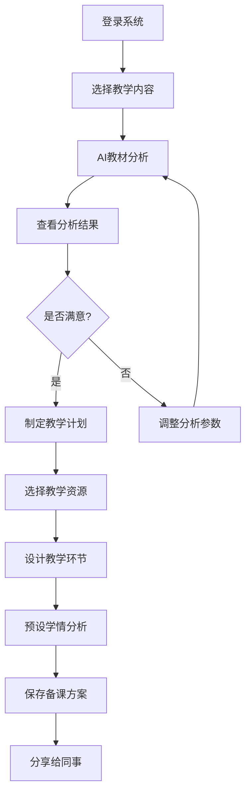
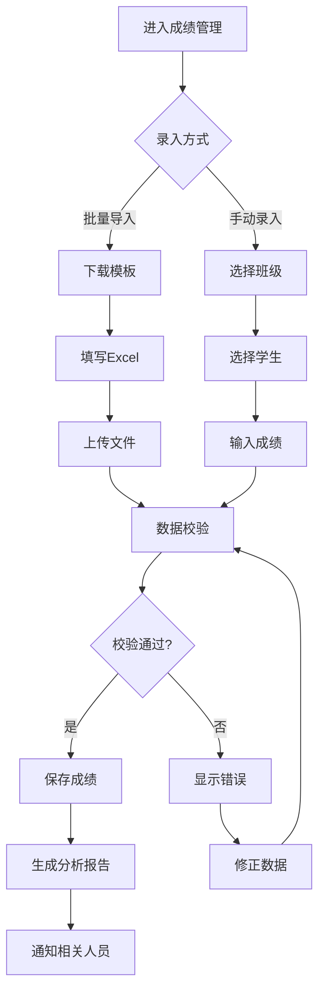

# 智能教学助手用户体验设计规范

## 1. 用户体验设计概述

### 1.1 设计理念

#### 以用户为中心
- **用户优先**：所有设计决策都以用户需求为出发点
- **场景驱动**：基于真实的教学场景设计交互流程
- **数据支撑**：通过用户研究和数据分析指导设计
- **持续优化**：基于用户反馈不断迭代改进

#### 教育价值导向
- **学习效果**：提升教学质量和学习效率
- **减负增效**：简化教师工作流程，减少重复劳动
- **个性化**：支持个性化教学和学习
- **可持续**：培养良好的学习习惯和方法

### 1.2 设计目标

#### 易用性目标
- **学习成本**：新用户5分钟内掌握核心功能
- **操作效率**：常用任务操作步骤不超过3步
- **错误率**：用户操作错误率低于5%
- **满意度**：用户满意度评分达到4.5分以上（5分制）

#### 功能性目标
- **功能完整性**：覆盖教学全流程的核心需求
- **数据准确性**：成绩分析准确率达到99%以上
- **响应速度**：页面加载时间不超过2秒
- **稳定性**：系统可用性达到99.9%

### 1.3 目标用户分析

#### 主要用户群体

##### 教师用户
```yaml
基本特征:
  年龄: 25-55岁
  技术水平: 中等
  设备使用: 电脑为主，手机为辅
  
核心需求:
  - 高效的备课和教学工具
  - 便捷的成绩管理功能
  - 准确的学情分析报告
  - 个性化的教学建议
  
使用场景:
  - 办公室备课
  - 课堂教学
  - 课后批改和分析
  - 家校沟通
  
痛点问题:
  - 备课时间长，资源分散
  - 成绩录入繁琐，易出错
  - 学情分析不够深入
  - 个性化教学难以实施
```

##### 学生用户
```yaml
基本特征:
  年龄: 12-18岁
  技术水平: 较高
  设备使用: 手机为主，平板为辅
  
核心需求:
  - 清晰的学习进度展示
  - 个性化的学习建议
  - 便捷的作业提交
  - 及时的成绩反馈
  
使用场景:
  - 课堂学习
  - 课后复习
  - 作业完成
  - 成绩查看
  
痛点问题:
  - 学习目标不明确
  - 缺乏个性化指导
  - 学习反馈不及时
  - 学习动力不足
```

##### 家长用户
```yaml
基本特征:
  年龄: 35-50岁
  技术水平: 中低等
  设备使用: 手机为主
  
核心需求:
  - 了解孩子学习情况
  - 获得家庭教育建议
  - 与老师便捷沟通
  - 监督学习进度
  
使用场景:
  - 查看成绩报告
  - 了解学习进度
  - 与教师沟通
  - 辅导孩子学习
  
痛点问题:
  - 不了解孩子真实学习状况
  - 缺乏专业的教育指导
  - 与学校沟通不畅
  - 辅导能力有限
```

## 2. 用户体验原则

### 2.1 可用性原则

#### 简单易用
```scss
// 简化操作流程
.simple-operation {
  // 减少操作步骤
  max-steps: 3;
  
  // 明确的操作指引
  .operation-guide {
    visibility: visible;
    position: relative;
    
    .step-indicator {
      display: flex;
      justify-content: center;
      margin-bottom: 16px;
      
      .step {
        width: 32px;
        height: 32px;
        border-radius: 50%;
        display: flex;
        align-items: center;
        justify-content: center;
        margin: 0 8px;
        
        &.active {
          background: #1890ff;
          color: #fff;
        }
        
        &.completed {
          background: #52c41a;
          color: #fff;
        }
        
        &.pending {
          background: #f5f5f5;
          color: #999;
        }
      }
    }
  }
  
  // 一键操作
  .quick-action {
    .action-button {
      width: 100%;
      height: 48px;
      background: #1890ff;
      color: #fff;
      border: none;
      border-radius: 8px;
      font-size: 16px;
      font-weight: 500;
      cursor: pointer;
      
      &:hover {
        background: #40a9ff;
      }
      
      &:active {
        background: #096dd9;
      }
    }
  }
}
```

#### 一致性
```scss
// 设计一致性
:root {
  // 颜色一致性
  --primary-color: #1890ff;
  --success-color: #52c41a;
  --warning-color: #fa8c16;
  --error-color: #ff4d4f;
  
  // 字体一致性
  --font-family: -apple-system, BlinkMacSystemFont, 'Segoe UI', Roboto, sans-serif;
  --font-size-small: 12px;
  --font-size-base: 14px;
  --font-size-large: 16px;
  --font-size-xl: 18px;
  
  // 间距一致性
  --spacing-xs: 4px;
  --spacing-sm: 8px;
  --spacing-md: 16px;
  --spacing-lg: 24px;
  --spacing-xl: 32px;
  
  // 圆角一致性
  --border-radius-sm: 4px;
  --border-radius-md: 8px;
  --border-radius-lg: 12px;
}

// 组件一致性
.consistent-button {
  padding: var(--spacing-sm) var(--spacing-md);
  border-radius: var(--border-radius-md);
  font-family: var(--font-family);
  font-size: var(--font-size-base);
  transition: all 0.2s ease;
  
  &.primary {
    background: var(--primary-color);
    color: #fff;
  }
  
  &.secondary {
    background: #f5f5f5;
    color: #262626;
  }
}
```

#### 可预测性
```javascript
// 行为可预测性
class PredictableInteraction {
  constructor() {
    this.setupConsistentBehaviors();
  }
  
  setupConsistentBehaviors() {
    // 统一的加载状态
    this.setupLoadingStates();
    
    // 统一的错误处理
    this.setupErrorHandling();
    
    // 统一的成功反馈
    this.setupSuccessFeedback();
  }
  
  setupLoadingStates() {
    document.addEventListener('fetch-start', (e) => {
      const target = e.detail.target;
      this.showLoading(target);
    });
    
    document.addEventListener('fetch-end', (e) => {
      const target = e.detail.target;
      this.hideLoading(target);
    });
  }
  
  setupErrorHandling() {
    window.addEventListener('unhandledrejection', (e) => {
      this.showErrorMessage('操作失败，请重试');
    });
  }
  
  setupSuccessFeedback() {
    document.addEventListener('operation-success', (e) => {
      this.showSuccessMessage(e.detail.message || '操作成功');
    });
  }
  
  showLoading(target) {
    if (target) {
      target.classList.add('loading');
      target.disabled = true;
    }
  }
  
  hideLoading(target) {
    if (target) {
      target.classList.remove('loading');
      target.disabled = false;
    }
  }
  
  showErrorMessage(message) {
    this.showToast(message, 'error');
  }
  
  showSuccessMessage(message) {
    this.showToast(message, 'success');
  }
  
  showToast(message, type) {
    const toast = document.createElement('div');
    toast.className = `toast toast-${type}`;
    toast.textContent = message;
    
    document.body.appendChild(toast);
    
    setTimeout(() => {
      toast.classList.add('show');
    }, 100);
    
    setTimeout(() => {
      toast.classList.remove('show');
      setTimeout(() => {
        document.body.removeChild(toast);
      }, 300);
    }, 3000);
  }
}
```

### 2.2 可访问性原则

#### 键盘导航
```scss
// 键盘导航支持
.keyboard-accessible {
  // 焦点可见性
  &:focus {
    outline: 2px solid #1890ff;
    outline-offset: 2px;
  }
  
  // 跳过链接
  .skip-link {
    position: absolute;
    top: -40px;
    left: 6px;
    background: #1890ff;
    color: #fff;
    padding: 8px;
    text-decoration: none;
    border-radius: 4px;
    z-index: 1000;
    
    &:focus {
      top: 6px;
    }
  }
  
  // 焦点陷阱（模态框）
  .modal {
    &[aria-hidden="false"] {
      .modal-content {
        // 确保焦点在模态框内循环
        &:focus {
          outline: none;
        }
      }
    }
  }
}
```

#### 屏幕阅读器支持
```html
<!-- 语义化HTML结构 -->
<main role="main" aria-label="主要内容">
  <section aria-labelledby="grade-section-title">
    <h2 id="grade-section-title">成绩管理</h2>
    
    <!-- 数据表格 -->
    <table role="table" aria-label="学生成绩表">
      <caption>2024年春季学期期中考试成绩</caption>
      <thead>
        <tr>
          <th scope="col">学生姓名</th>
          <th scope="col">语文</th>
          <th scope="col">数学</th>
          <th scope="col">英语</th>
          <th scope="col">总分</th>
        </tr>
      </thead>
      <tbody>
        <tr>
          <th scope="row">张三</th>
          <td>85</td>
          <td>92</td>
          <td>88</td>
          <td>265</td>
        </tr>
      </tbody>
    </table>
    
    <!-- 表单 -->
    <form aria-label="添加学生成绩">
      <fieldset>
        <legend>学生信息</legend>
        
        <label for="student-name">学生姓名 <span aria-label="必填">*</span></label>
        <input 
          id="student-name" 
          type="text" 
          required 
          aria-describedby="name-help"
          aria-invalid="false"
        >
        <div id="name-help" class="help-text">请输入学生的真实姓名</div>
        
        <label for="subject-score">科目成绩</label>
        <input 
          id="subject-score" 
          type="number" 
          min="0" 
          max="100"
          aria-describedby="score-help"
        >
        <div id="score-help" class="help-text">成绩范围：0-100分</div>
      </fieldset>
      
      <button type="submit" aria-describedby="submit-help">
        提交成绩
      </button>
      <div id="submit-help" class="help-text">点击提交将保存学生成绩信息</div>
    </form>
  </section>
</main>

<!-- 状态公告 -->
<div aria-live="polite" aria-atomic="true" class="sr-only" id="status-announcements"></div>
<div aria-live="assertive" aria-atomic="true" class="sr-only" id="error-announcements"></div>
```

#### 颜色和对比度
```scss
// 颜色对比度规范
.accessible-colors {
  // 正常文本：4.5:1 对比度
  .normal-text {
    color: #262626; // 对比度 8.59:1 (白色背景)
    background: #fff;
  }
  
  // 大文本：3:1 对比度
  .large-text {
    font-size: 18px;
    font-weight: bold;
    color: #595959; // 对比度 4.54:1
    background: #fff;
  }
  
  // 链接颜色
  .link-text {
    color: #1890ff; // 对比度 4.52:1
    
    &:hover {
      color: #096dd9; // 对比度 5.93:1
    }
    
    &:visited {
      color: #722ed1; // 对比度 4.51:1
    }
  }
  
  // 错误状态
  .error-text {
    color: #ff4d4f; // 对比度 4.5:1
    background: #fff2f0;
  }
  
  // 成功状态
  .success-text {
    color: #52c41a; // 对比度 4.5:1
    background: #f6ffed;
  }
  
  // 警告状态
  .warning-text {
    color: #fa8c16; // 对比度 4.5:1
    background: #fff7e6;
  }
}

// 色盲友好设计
.colorblind-friendly {
  // 使用图标和文字辅助颜色
  .status-indicator {
    display: flex;
    align-items: center;
    gap: 4px;
    
    .status-icon {
      width: 16px;
      height: 16px;
    }
    
    .status-text {
      font-weight: 500;
    }
    
    &.success {
      .status-icon {
        background: url('check-icon.svg');
      }
      .status-text {
        color: #52c41a;
      }
    }
    
    &.error {
      .status-icon {
        background: url('error-icon.svg');
      }
      .status-text {
        color: #ff4d4f;
      }
    }
    
    &.warning {
      .status-icon {
        background: url('warning-icon.svg');
      }
      .status-text {
        color: #fa8c16;
      }
    }
  }
}
```

### 2.3 情感化设计

#### 微交互设计
```scss
// 微交互动画
@keyframes button-press {
  0% {
    transform: scale(1);
  }
  50% {
    transform: scale(0.95);
  }
  100% {
    transform: scale(1);
  }
}

@keyframes success-bounce {
  0%, 20%, 53%, 80%, 100% {
    transform: translate3d(0, 0, 0);
  }
  40%, 43% {
    transform: translate3d(0, -8px, 0);
  }
  70% {
    transform: translate3d(0, -4px, 0);
  }
  90% {
    transform: translate3d(0, -2px, 0);
  }
}

@keyframes loading-pulse {
  0% {
    opacity: 1;
  }
  50% {
    opacity: 0.5;
  }
  100% {
    opacity: 1;
  }
}

.micro-interactions {
  .interactive-button {
    transition: all 0.2s ease;
    
    &:active {
      animation: button-press 0.2s ease;
    }
    
    &.success {
      animation: success-bounce 0.6s ease;
    }
  }
  
  .loading-element {
    animation: loading-pulse 1.5s ease-in-out infinite;
  }
  
  .hover-lift {
    transition: transform 0.2s ease, box-shadow 0.2s ease;
    
    &:hover {
      transform: translateY(-2px);
      box-shadow: 0 4px 12px rgba(0, 0, 0, 0.15);
    }
  }
}
```

#### 个性化元素
```javascript
// 个性化用户体验
class PersonalizationEngine {
  constructor() {
    this.userPreferences = this.loadUserPreferences();
    this.applyPersonalization();
  }
  
  loadUserPreferences() {
    const saved = localStorage.getItem('userPreferences');
    return saved ? JSON.parse(saved) : {
      theme: 'light',
      language: 'zh-CN',
      fontSize: 'medium',
      animations: true,
      notifications: true
    };
  }
  
  applyPersonalization() {
    this.applyTheme();
    this.applyFontSize();
    this.applyAnimations();
    this.setupGreeting();
  }
  
  applyTheme() {
    document.body.className = `theme-${this.userPreferences.theme}`;
  }
  
  applyFontSize() {
    document.body.style.fontSize = {
      small: '12px',
      medium: '14px',
      large: '16px'
    }[this.userPreferences.fontSize];
  }
  
  applyAnimations() {
    if (!this.userPreferences.animations) {
      document.body.classList.add('no-animations');
    }
  }
  
  setupGreeting() {
    const hour = new Date().getHours();
    let greeting;
    
    if (hour < 6) {
      greeting = '夜深了，注意休息';
    } else if (hour < 12) {
      greeting = '早上好';
    } else if (hour < 18) {
      greeting = '下午好';
    } else {
      greeting = '晚上好';
    }
    
    const greetingElement = document.querySelector('.user-greeting');
    if (greetingElement) {
      greetingElement.textContent = greeting;
    }
  }
  
  updatePreference(key, value) {
    this.userPreferences[key] = value;
    localStorage.setItem('userPreferences', JSON.stringify(this.userPreferences));
    this.applyPersonalization();
  }
}
```

## 3. 用户流程设计

### 3.1 核心流程设计

#### 教师备课流程


#### 成绩录入流程


### 3.2 用户引导设计

#### 新手引导
```javascript
// 新手引导系统
class OnboardingGuide {
  constructor() {
    this.steps = [];
    this.currentStep = 0;
    this.overlay = null;
    this.tooltip = null;
  }
  
  addStep(step) {
    this.steps.push({
      target: step.target,
      title: step.title,
      content: step.content,
      position: step.position || 'bottom',
      action: step.action || null
    });
  }
  
  start() {
    if (this.steps.length === 0) return;
    
    this.createOverlay();
    this.showStep(0);
  }
  
  createOverlay() {
    this.overlay = document.createElement('div');
    this.overlay.className = 'onboarding-overlay';
    this.overlay.innerHTML = `
      <div class="overlay-background"></div>
      <div class="tooltip">
        <div class="tooltip-header">
          <h3 class="tooltip-title"></h3>
          <button class="tooltip-close">×</button>
        </div>
        <div class="tooltip-content"></div>
        <div class="tooltip-footer">
          <div class="step-indicator">
            <span class="current-step"></span> / <span class="total-steps"></span>
          </div>
          <div class="tooltip-actions">
            <button class="btn-skip">跳过</button>
            <button class="btn-prev">上一步</button>
            <button class="btn-next">下一步</button>
          </div>
        </div>
      </div>
    `;
    
    document.body.appendChild(this.overlay);
    this.bindEvents();
  }
  
  showStep(index) {
    if (index < 0 || index >= this.steps.length) return;
    
    this.currentStep = index;
    const step = this.steps[index];
    const target = document.querySelector(step.target);
    
    if (!target) {
      this.nextStep();
      return;
    }
    
    // 高亮目标元素
    this.highlightTarget(target);
    
    // 更新提示内容
    this.updateTooltip(step);
    
    // 定位提示框
    this.positionTooltip(target, step.position);
    
    // 执行自定义动作
    if (step.action) {
      step.action();
    }
  }
  
  highlightTarget(target) {
    // 移除之前的高亮
    document.querySelectorAll('.onboarding-highlight').forEach(el => {
      el.classList.remove('onboarding-highlight');
    });
    
    // 添加高亮
    target.classList.add('onboarding-highlight');
    
    // 滚动到目标元素
    target.scrollIntoView({ behavior: 'smooth', block: 'center' });
  }
  
  updateTooltip(step) {
    const tooltip = this.overlay.querySelector('.tooltip');
    tooltip.querySelector('.tooltip-title').textContent = step.title;
    tooltip.querySelector('.tooltip-content').innerHTML = step.content;
    tooltip.querySelector('.current-step').textContent = this.currentStep + 1;
    tooltip.querySelector('.total-steps').textContent = this.steps.length;
    
    // 更新按钮状态
    const prevBtn = tooltip.querySelector('.btn-prev');
    const nextBtn = tooltip.querySelector('.btn-next');
    
    prevBtn.disabled = this.currentStep === 0;
    nextBtn.textContent = this.currentStep === this.steps.length - 1 ? '完成' : '下一步';
  }
  
  positionTooltip(target, position) {
    const tooltip = this.overlay.querySelector('.tooltip');
    const targetRect = target.getBoundingClientRect();
    const tooltipRect = tooltip.getBoundingClientRect();
    
    let top, left;
    
    switch (position) {
      case 'top':
        top = targetRect.top - tooltipRect.height - 10;
        left = targetRect.left + (targetRect.width - tooltipRect.width) / 2;
        break;
      case 'bottom':
        top = targetRect.bottom + 10;
        left = targetRect.left + (targetRect.width - tooltipRect.width) / 2;
        break;
      case 'left':
        top = targetRect.top + (targetRect.height - tooltipRect.height) / 2;
        left = targetRect.left - tooltipRect.width - 10;
        break;
      case 'right':
        top = targetRect.top + (targetRect.height - tooltipRect.height) / 2;
        left = targetRect.right + 10;
        break;
    }
    
    // 确保提示框在视口内
    top = Math.max(10, Math.min(top, window.innerHeight - tooltipRect.height - 10));
    left = Math.max(10, Math.min(left, window.innerWidth - tooltipRect.width - 10));
    
    tooltip.style.top = `${top}px`;
    tooltip.style.left = `${left}px`;
  }
  
  bindEvents() {
    const tooltip = this.overlay.querySelector('.tooltip');
    
    tooltip.querySelector('.btn-next').addEventListener('click', () => {
      if (this.currentStep === this.steps.length - 1) {
        this.finish();
      } else {
        this.nextStep();
      }
    });
    
    tooltip.querySelector('.btn-prev').addEventListener('click', () => {
      this.prevStep();
    });
    
    tooltip.querySelector('.btn-skip').addEventListener('click', () => {
      this.finish();
    });
    
    tooltip.querySelector('.tooltip-close').addEventListener('click', () => {
      this.finish();
    });
  }
  
  nextStep() {
    this.showStep(this.currentStep + 1);
  }
  
  prevStep() {
    this.showStep(this.currentStep - 1);
  }
  
  finish() {
    // 移除高亮
    document.querySelectorAll('.onboarding-highlight').forEach(el => {
      el.classList.remove('onboarding-highlight');
    });
    
    // 移除覆盖层
    if (this.overlay) {
      document.body.removeChild(this.overlay);
      this.overlay = null;
    }
    
    // 标记引导完成
    localStorage.setItem('onboarding-completed', 'true');
  }
}

// 使用示例
const guide = new OnboardingGuide();

guide.addStep({
  target: '.main-nav',
  title: '欢迎使用智能教学助手',
  content: '这里是主导航栏，您可以快速访问各个功能模块。'
});

guide.addStep({
  target: '.grade-management',
  title: '成绩管理',
  content: '点击这里可以录入和管理学生成绩，系统会自动生成分析报告。'
});

guide.addStep({
  target: '.ai-analysis',
  title: 'AI智能分析',
  content: '我们的AI会根据学生成绩提供个性化的教学建议。'
});

// 检查是否需要显示引导
if (!localStorage.getItem('onboarding-completed')) {
  guide.start();
}
```

### 3.3 错误处理和恢复

#### 错误状态设计
```scss
// 错误状态样式
.error-states {
  .error-page {
    display: flex;
    flex-direction: column;
    align-items: center;
    justify-content: center;
    min-height: 400px;
    padding: 40px 20px;
    text-align: center;
    
    .error-icon {
      width: 120px;
      height: 120px;
      margin-bottom: 24px;
      opacity: 0.6;
    }
    
    .error-title {
      font-size: 24px;
      font-weight: 600;
      color: #262626;
      margin-bottom: 12px;
    }
    
    .error-description {
      font-size: 16px;
      color: #595959;
      line-height: 1.5;
      margin-bottom: 32px;
      max-width: 400px;
    }
    
    .error-actions {
      display: flex;
      gap: 16px;
      flex-wrap: wrap;
      justify-content: center;
      
      .error-btn {
        padding: 12px 24px;
        border-radius: 8px;
        font-size: 14px;
        font-weight: 500;
        cursor: pointer;
        transition: all 0.2s ease;
        
        &.primary {
          background: #1890ff;
          color: #fff;
          border: none;
          
          &:hover {
            background: #40a9ff;
          }
        }
        
        &.secondary {
          background: #f5f5f5;
          color: #595959;
          border: 1px solid #d9d9d9;
          
          &:hover {
            background: #e6e6e6;
          }
        }
      }
    }
  }
  
  // 表单错误状态
  .form-field {
    &.error {
      .field-input {
        border-color: #ff4d4f;
        box-shadow: 0 0 0 2px rgba(255, 77, 79, 0.2);
      }
      
      .field-error {
        display: block;
        color: #ff4d4f;
        font-size: 12px;
        margin-top: 4px;
      }
    }
  }
  
  // 网络错误提示
  .network-error {
    position: fixed;
    top: 20px;
    left: 50%;
    transform: translateX(-50%);
    background: #ff4d4f;
    color: #fff;
    padding: 12px 20px;
    border-radius: 8px;
    font-size: 14px;
    z-index: 1000;
    
    .retry-btn {
      background: rgba(255, 255, 255, 0.2);
      border: 1px solid rgba(255, 255, 255, 0.3);
      color: #fff;
      padding: 4px 12px;
      border-radius: 4px;
      margin-left: 12px;
      cursor: pointer;
      
      &:hover {
        background: rgba(255, 255, 255, 0.3);
      }
    }
  }
}
```

#### 数据恢复机制
```javascript
// 数据恢复和自动保存
class DataRecovery {
  constructor() {
    this.autoSaveInterval = 30000; // 30秒自动保存
    this.storageKey = 'app-data-backup';
    this.setupAutoSave();
    this.setupRecovery();
  }
  
  setupAutoSave() {
    setInterval(() => {
      this.saveCurrentState();
    }, this.autoSaveInterval);
    
    // 页面卸载时保存
    window.addEventListener('beforeunload', () => {
      this.saveCurrentState();
    });
  }
  
  setupRecovery() {
    // 页面加载时检查是否有未保存的数据
    window.addEventListener('load', () => {
      this.checkForRecovery();
    });
  }
  
  saveCurrentState() {
    const formData = this.collectFormData();
    const timestamp = Date.now();
    
    const backupData = {
      timestamp,
      data: formData,
      url: window.location.href
    };
    
    try {
      localStorage.setItem(this.storageKey, JSON.stringify(backupData));
    } catch (e) {
      console.warn('无法保存备份数据:', e);
    }
  }
  
  collectFormData() {
    const forms = document.querySelectorAll('form');
    const formData = {};
    
    forms.forEach((form, index) => {
      const data = new FormData(form);
      formData[`form_${index}`] = Object.fromEntries(data.entries());
    });
    
    return formData;
  }
  
  checkForRecovery() {
    try {
      const backupData = localStorage.getItem(this.storageKey);
      if (!backupData) return;
      
      const backup = JSON.parse(backupData);
      const timeDiff = Date.now() - backup.timestamp;
      
      // 如果备份数据在1小时内且在同一页面
      if (timeDiff < 3600000 && backup.url === window.location.href) {
        this.showRecoveryDialog(backup);
      } else {
        // 清除过期备份
        localStorage.removeItem(this.storageKey);
      }
    } catch (e) {
      console.warn('恢复数据时出错:', e);
    }
  }
  
  showRecoveryDialog(backup) {
    const dialog = document.createElement('div');
    dialog.className = 'recovery-dialog';
    dialog.innerHTML = `
      <div class="dialog-overlay"></div>
      <div class="dialog-content">
        <div class="dialog-header">
          <h3>发现未保存的数据</h3>
        </div>
        <div class="dialog-body">
          <p>检测到您有未保存的表单数据，是否要恢复？</p>
          <p class="recovery-time">保存时间：${new Date(backup.timestamp).toLocaleString()}</p>
        </div>
        <div class="dialog-footer">
          <button class="btn-cancel">忽略</button>
          <button class="btn-recover">恢复数据</button>
        </div>
      </div>
    `;
    
    document.body.appendChild(dialog);
    
    // 绑定事件
    dialog.querySelector('.btn-recover').addEventListener('click', () => {
      this.restoreData(backup.data);
      document.body.removeChild(dialog);
      localStorage.removeItem(this.storageKey);
    });
    
    dialog.querySelector('.btn-cancel').addEventListener('click', () => {
      document.body.removeChild(dialog);
      localStorage.removeItem(this.storageKey);
    });
  }
  
  restoreData(formData) {
    Object.keys(formData).forEach(formKey => {
      const formIndex = parseInt(formKey.split('_')[1]);
      const form = document.querySelectorAll('form')[formIndex];
      
      if (form) {
        const data = formData[formKey];
        Object.keys(data).forEach(fieldName => {
          const field = form.querySelector(`[name="${fieldName}"]`);
          if (field) {
            field.value = data[fieldName];
          }
        });
      }
    });
    
    // 显示恢复成功提示
    this.showSuccessMessage('数据已恢复');
  }
  
  showSuccessMessage(message) {
    const toast = document.createElement('div');
    toast.className = 'toast toast-success';
    toast.textContent = message;
    
    document.body.appendChild(toast);
    
    setTimeout(() => {
      toast.classList.add('show');
    }, 100);
    
    setTimeout(() => {
      toast.classList.remove('show');
      setTimeout(() => {
        document.body.removeChild(toast);
      }, 300);
    }, 3000);
  }
}

// 初始化数据恢复
new DataRecovery();
```

## 4. 用户反馈和测试

### 4.1 用户反馈收集

#### 反馈组件
```javascript
// 用户反馈收集系统
class FeedbackCollector {
  constructor() {
    this.feedbackData = [];
    this.init();
  }
  
  init() {
    this.createFeedbackButton();
    this.setupEventTracking();
  }
  
  createFeedbackButton() {
    const button = document.createElement('button');
    button.className = 'feedback-button';
    button.innerHTML = '💬 反馈';
    button.addEventListener('click', () => this.showFeedbackModal());
    
    document.body.appendChild(button);
  }
  
  showFeedbackModal() {
    const modal = document.createElement('div');
    modal.className = 'feedback-modal';
    modal.innerHTML = `
      <div class="modal-overlay"></div>
      <div class="modal-content">
        <div class="modal-header">
          <h3>用户反馈</h3>
          <button class="modal-close">×</button>
        </div>
        <div class="modal-body">
          <form class="feedback-form">
            <div class="form-group">
              <label>反馈类型</label>
              <select name="type" required>
                <option value="">请选择</option>
                <option value="bug">问题报告</option>
                <option value="feature">功能建议</option>
                <option value="improvement">改进建议</option>
                <option value="other">其他</option>
              </select>
            </div>
            
            <div class="form-group">
              <label>满意度评分</label>
              <div class="rating-stars">
                <span class="star" data-rating="1">⭐</span>
                <span class="star" data-rating="2">⭐</span>
                <span class="star" data-rating="3">⭐</span>
                <span class="star" data-rating="4">⭐</span>
                <span class="star" data-rating="5">⭐</span>
              </div>
              <input type="hidden" name="rating" required>
            </div>
            
            <div class="form-group">
              <label>详细描述</label>
              <textarea name="description" rows="4" placeholder="请详细描述您的问题或建议..." required></textarea>
            </div>
            
            <div class="form-group">
              <label>联系方式（可选）</label>
              <input type="email" name="contact" placeholder="您的邮箱地址">
            </div>
            
            <div class="form-actions">
              <button type="button" class="btn-cancel">取消</button>
              <button type="submit" class="btn-submit">提交反馈</button>
            </div>
          </form>
        </div>
      </div>
    `;
    
    document.body.appendChild(modal);
    this.bindModalEvents(modal);
  }
  
  bindModalEvents(modal) {
    // 关闭模态框
    const closeModal = () => {
      document.body.removeChild(modal);
    };
    
    modal.querySelector('.modal-close').addEventListener('click', closeModal);
    modal.querySelector('.btn-cancel').addEventListener('click', closeModal);
    modal.querySelector('.modal-overlay').addEventListener('click', closeModal);
    
    // 星级评分
    const stars = modal.querySelectorAll('.star');
    const ratingInput = modal.querySelector('input[name="rating"]');
    
    stars.forEach((star, index) => {
      star.addEventListener('click', () => {
        const rating = index + 1;
        ratingInput.value = rating;
        
        stars.forEach((s, i) => {
          s.style.opacity = i < rating ? '1' : '0.3';
        });
      });
    });
    
    // 提交表单
    const form = modal.querySelector('.feedback-form');
    form.addEventListener('submit', (e) => {
      e.preventDefault();
      this.submitFeedback(new FormData(form));
      closeModal();
    });
  }
  
  submitFeedback(formData) {
    const feedback = {
      id: Date.now(),
      timestamp: new Date().toISOString(),
      type: formData.get('type'),
      rating: parseInt(formData.get('rating')),
      description: formData.get('description'),
      contact: formData.get('contact'),
      url: window.location.href,
      userAgent: navigator.userAgent,
      viewport: `${window.innerWidth}x${window.innerHeight}`
    };
    
    // 保存到本地
    this.feedbackData.push(feedback);
    localStorage.setItem('user-feedback', JSON.stringify(this.feedbackData));
    
    // 发送到服务器
    this.sendToServer(feedback);
    
    // 显示成功提示
    this.showSuccessMessage('感谢您的反馈！');
  }
  
  sendToServer(feedback) {
    fetch('/api/feedback', {
      method: 'POST',
      headers: {
        'Content-Type': 'application/json'
      },
      body: JSON.stringify(feedback)
    }).catch(error => {
      console.warn('反馈提交失败:', error);
    });
  }
  
  setupEventTracking() {
    // 跟踪用户行为
    document.addEventListener('click', (e) => {
      this.trackEvent('click', {
        element: e.target.tagName,
        className: e.target.className,
        text: e.target.textContent?.substring(0, 50)
      });
    });
    
    // 跟踪页面停留时间
    let startTime = Date.now();
    window.addEventListener('beforeunload', () => {
      const duration = Date.now() - startTime;
      this.trackEvent('page_duration', { duration });
    });
  }
  
  trackEvent(eventType, data) {
    const event = {
      type: eventType,
      timestamp: new Date().toISOString(),
      data,
      url: window.location.href
    };
    
    // 发送事件数据
    if (navigator.sendBeacon) {
      navigator.sendBeacon('/api/events', JSON.stringify(event));
    }
  }
  
  showSuccessMessage(message) {
    const toast = document.createElement('div');
    toast.className = 'toast toast-success';
    toast.textContent = message;
    
    document.body.appendChild(toast);
    
    setTimeout(() => {
      toast.classList.add('show');
    }, 100);
    
    setTimeout(() => {
      toast.classList.remove('show');
      setTimeout(() => {
        document.body.removeChild(toast);
      }, 300);
    }, 3000);
  }
}

// 初始化反馈收集器
new FeedbackCollector();
```

### 4.2 A/B测试框架

#### 测试配置
```javascript
// A/B测试框架
class ABTestFramework {
  constructor() {
    this.tests = new Map();
    this.userGroup = this.getUserGroup();
    this.init();
  }
  
  getUserGroup() {
    let group = localStorage.getItem('ab-test-group');
    if (!group) {
      group = Math.random() < 0.5 ? 'A' : 'B';
      localStorage.setItem('ab-test-group', group);
    }
    return group;
  }
  
  defineTest(testName, variants) {
    this.tests.set(testName, {
      variants,
      active: true
    });
  }
  
  getVariant(testName) {
    const test = this.tests.get(testName);
    if (!test || !test.active) {
      return test?.variants.A || null;
    }
    
    return test.variants[this.userGroup] || test.variants.A;
  }
  
  trackConversion(testName, conversionType = 'default') {
    const variant = this.userGroup;
    const event = {
      testName,
      variant,
      conversionType,
      timestamp: new Date().toISOString(),
      url: window.location.href
    };
    
    // 发送转化数据
    this.sendConversionData(event);
  }
  
  sendConversionData(event) {
    fetch('/api/ab-test/conversion', {
      method: 'POST',
      headers: {
        'Content-Type': 'application/json'
      },
      body: JSON.stringify(event)
    }).catch(error => {
      console.warn('A/B测试数据发送失败:', error);
    });
  }
  
  init() {
    // 定义测试
    this.defineTest('button-color', {
      A: { color: '#1890ff', text: '提交' },
      B: { color: '#52c41a', text: '立即提交' }
    });
    
    this.defineTest('form-layout', {
      A: 'vertical',
      B: 'horizontal'
    });
    
    // 应用测试
    this.applyTests();
  }
  
  applyTests() {
    // 应用按钮颜色测试
    const buttonVariant = this.getVariant('button-color');
    if (buttonVariant) {
      const submitButtons = document.querySelectorAll('.submit-btn');
      submitButtons.forEach(btn => {
        btn.style.backgroundColor = buttonVariant.color;
        btn.textContent = buttonVariant.text;
      });
    }
    
    // 应用表单布局测试
    const layoutVariant = this.getVariant('form-layout');
    if (layoutVariant === 'horizontal') {
      document.body.classList.add('horizontal-form-layout');
    }
  }
}

// 初始化A/B测试
const abTest = new ABTestFramework();

// 在关键操作处跟踪转化
document.addEventListener('submit', (e) => {
  if (e.target.classList.contains('grade-form')) {
    abTest.trackConversion('button-color', 'form-submit');
  }
});
```

---

本用户体验设计规范为智能教学助手提供了全面的UX设计指导，确保产品能够为用户提供优秀的使用体验，满足教育场景下的特殊需求，并通过持续的用户反馈和测试不断优化产品体验。