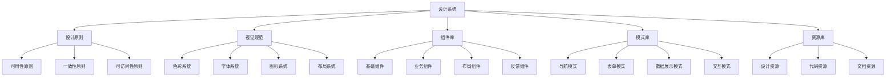

# 智能教学助手设计系统文档

## 1. 设计系统概述

### 1.1 设计系统简介

智能教学助手设计系统是一套完整的设计语言和组件库，旨在为教育科技产品提供一致、高效、易用的用户界面解决方案。本设计系统基于现代设计原则，结合教育场景的特殊需求，确保产品在不同平台和设备上都能提供优秀的用户体验。

### 1.2 设计系统目标

#### 一致性目标
- **视觉一致性**：统一的色彩、字体、间距和组件样式
- **交互一致性**：标准化的用户操作模式和反馈机制
- **体验一致性**：跨平台、跨设备的统一用户体验

#### 效率目标
- **设计效率**：提供可复用的设计模板和组件
- **开发效率**：标准化的代码结构和组件实现
- **维护效率**：集中化的设计规范管理

#### 质量目标
- **可用性**：符合用户习惯的界面设计
- **可访问性**：支持无障碍访问的设计规范
- **性能**：优化的组件实现和资源加载

### 1.3 设计系统架构



## 2. 设计原则

### 2.1 核心设计原则

#### 教育导向
```yaml
原则描述: 所有设计决策都应以提升教学效果为目标
应用场景:
  - 功能优先级排序
  - 界面信息架构
  - 交互流程设计
  
设计要求:
  - 突出教学核心功能
  - 简化非核心操作
  - 提供清晰的学习路径
  - 支持个性化教学需求
```

#### 简洁高效
```yaml
原则描述: 通过简洁的设计提高用户操作效率
应用场景:
  - 界面布局设计
  - 操作流程优化
  - 信息层级规划
  
设计要求:
  - 减少不必要的视觉元素
  - 优化操作步骤
  - 提供快捷操作方式
  - 合理使用留白空间
```

#### 用户友好
```yaml
原则描述: 考虑不同用户群体的使用习惯和能力
应用场景:
  - 界面语言设计
  - 操作反馈设计
  - 错误处理设计
  
设计要求:
  - 使用通俗易懂的语言
  - 提供及时的操作反馈
  - 设计友好的错误提示
  - 支持多种操作方式
```

### 2.2 设计价值观

#### 包容性设计
- **多样性支持**：考虑不同年龄、技能水平的用户
- **无障碍设计**：确保残障用户也能正常使用
- **文化适应性**：适应不同地区的文化习惯
- **设备兼容性**：支持各种设备和屏幕尺寸

#### 可持续设计
- **模块化设计**：便于功能扩展和维护
- **标准化规范**：确保设计的可复用性
- **性能优化**：减少资源消耗和加载时间
- **环保意识**：考虑数字产品的环境影响

## 3. 视觉规范

### 3.1 色彩系统

#### 主色调定义
```scss
// 主色调
$primary-colors: (
  50: #e6f7ff,
  100: #bae7ff,
  200: #91d5ff,
  300: #69c0ff,
  400: #40a9ff,
  500: #1890ff,  // 主色
  600: #096dd9,
  700: #0050b3,
  800: #003a8c,
  900: #002766
);

// 辅助色调
$secondary-colors: (
  success: #52c41a,
  warning: #fa8c16,
  error: #ff4d4f,
  info: #13c2c2
);

// 中性色调
$neutral-colors: (
  white: #ffffff,
  gray-50: #fafafa,
  gray-100: #f5f5f5,
  gray-200: #f0f0f0,
  gray-300: #d9d9d9,
  gray-400: #bfbfbf,
  gray-500: #8c8c8c,
  gray-600: #595959,
  gray-700: #434343,
  gray-800: #262626,
  gray-900: #1f1f1f,
  black: #000000
);
```

#### 色彩使用规范
```scss
// 文本颜色
.text-colors {
  .text-primary { color: map-get($neutral-colors, gray-800); }
  .text-secondary { color: map-get($neutral-colors, gray-600); }
  .text-tertiary { color: map-get($neutral-colors, gray-500); }
  .text-disabled { color: map-get($neutral-colors, gray-400); }
  .text-link { color: map-get($primary-colors, 500); }
  .text-success { color: map-get($secondary-colors, success); }
  .text-warning { color: map-get($secondary-colors, warning); }
  .text-error { color: map-get($secondary-colors, error); }
}

// 背景颜色
.background-colors {
  .bg-primary { background-color: map-get($primary-colors, 500); }
  .bg-light { background-color: map-get($neutral-colors, gray-50); }
  .bg-white { background-color: map-get($neutral-colors, white); }
  .bg-success { background-color: map-get($secondary-colors, success); }
  .bg-warning { background-color: map-get($secondary-colors, warning); }
  .bg-error { background-color: map-get($secondary-colors, error); }
}

// 边框颜色
.border-colors {
  .border-light { border-color: map-get($neutral-colors, gray-200); }
  .border-medium { border-color: map-get($neutral-colors, gray-300); }
  .border-dark { border-color: map-get($neutral-colors, gray-400); }
  .border-primary { border-color: map-get($primary-colors, 500); }
}
```

### 3.2 字体系统

#### 字体族定义
```scss
// 字体族
$font-families: (
  primary: (-apple-system, BlinkMacSystemFont, 'Segoe UI', Roboto, 'Helvetica Neue', Arial, sans-serif),
  mono: ('SFMono-Regular', Consolas, 'Liberation Mono', Menlo, Courier, monospace),
  serif: (Georgia, 'Times New Roman', Times, serif)
);

// 字体大小
$font-sizes: (
  xs: 10px,
  sm: 12px,
  base: 14px,
  md: 16px,
  lg: 18px,
  xl: 20px,
  2xl: 24px,
  3xl: 30px,
  4xl: 36px,
  5xl: 48px
);

// 字体权重
$font-weights: (
  light: 300,
  normal: 400,
  medium: 500,
  semibold: 600,
  bold: 700
);

// 行高
$line-heights: (
  tight: 1.2,
  normal: 1.5,
  relaxed: 1.6,
  loose: 2.0
);
```

#### 排版规范
```scss
// 标题样式
.typography-headings {
  h1, .h1 {
    font-size: map-get($font-sizes, 4xl);
    font-weight: map-get($font-weights, bold);
    line-height: map-get($line-heights, tight);
    margin-bottom: 24px;
  }
  
  h2, .h2 {
    font-size: map-get($font-sizes, 3xl);
    font-weight: map-get($font-weights, semibold);
    line-height: map-get($line-heights, tight);
    margin-bottom: 20px;
  }
  
  h3, .h3 {
    font-size: map-get($font-sizes, 2xl);
    font-weight: map-get($font-weights, semibold);
    line-height: map-get($line-heights, normal);
    margin-bottom: 16px;
  }
  
  h4, .h4 {
    font-size: map-get($font-sizes, xl);
    font-weight: map-get($font-weights, medium);
    line-height: map-get($line-heights, normal);
    margin-bottom: 12px;
  }
  
  h5, .h5 {
    font-size: map-get($font-sizes, lg);
    font-weight: map-get($font-weights, medium);
    line-height: map-get($line-heights, normal);
    margin-bottom: 8px;
  }
  
  h6, .h6 {
    font-size: map-get($font-sizes, md);
    font-weight: map-get($font-weights, medium);
    line-height: map-get($line-heights, normal);
    margin-bottom: 8px;
  }
}

// 正文样式
.typography-body {
  .body-large {
    font-size: map-get($font-sizes, md);
    line-height: map-get($line-heights, relaxed);
  }
  
  .body-medium {
    font-size: map-get($font-sizes, base);
    line-height: map-get($line-heights, normal);
  }
  
  .body-small {
    font-size: map-get($font-sizes, sm);
    line-height: map-get($line-heights, normal);
  }
  
  .caption {
    font-size: map-get($font-sizes, xs);
    line-height: map-get($line-heights, normal);
    color: map-get($neutral-colors, gray-600);
  }
}
```

### 3.3 间距系统

#### 间距定义
```scss
// 间距系统
$spacings: (
  0: 0,
  1: 4px,
  2: 8px,
  3: 12px,
  4: 16px,
  5: 20px,
  6: 24px,
  7: 28px,
  8: 32px,
  10: 40px,
  12: 48px,
  16: 64px,
  20: 80px,
  24: 96px,
  32: 128px
);

// 生成间距工具类
@each $key, $value in $spacings {
  .m-#{$key} { margin: #{$value}; }
  .mt-#{$key} { margin-top: #{$value}; }
  .mr-#{$key} { margin-right: #{$value}; }
  .mb-#{$key} { margin-bottom: #{$value}; }
  .ml-#{$key} { margin-left: #{$value}; }
  .mx-#{$key} { margin-left: #{$value}; margin-right: #{$value}; }
  .my-#{$key} { margin-top: #{$value}; margin-bottom: #{$value}; }
  
  .p-#{$key} { padding: #{$value}; }
  .pt-#{$key} { padding-top: #{$value}; }
  .pr-#{$key} { padding-right: #{$value}; }
  .pb-#{$key} { padding-bottom: #{$value}; }
  .pl-#{$key} { padding-left: #{$value}; }
  .px-#{$key} { padding-left: #{$value}; padding-right: #{$value}; }
  .py-#{$key} { padding-top: #{$value}; padding-bottom: #{$value}; }
}
```

### 3.4 阴影系统

#### 阴影定义
```scss
// 阴影系统
$shadows: (
  none: none,
  sm: 0 1px 2px 0 rgba(0, 0, 0, 0.05),
  base: 0 1px 3px 0 rgba(0, 0, 0, 0.1), 0 1px 2px 0 rgba(0, 0, 0, 0.06),
  md: 0 4px 6px -1px rgba(0, 0, 0, 0.1), 0 2px 4px -1px rgba(0, 0, 0, 0.06),
  lg: 0 10px 15px -3px rgba(0, 0, 0, 0.1), 0 4px 6px -2px rgba(0, 0, 0, 0.05),
  xl: 0 20px 25px -5px rgba(0, 0, 0, 0.1), 0 10px 10px -5px rgba(0, 0, 0, 0.04),
  2xl: 0 25px 50px -12px rgba(0, 0, 0, 0.25),
  inner: inset 0 2px 4px 0 rgba(0, 0, 0, 0.06)
);

// 生成阴影工具类
@each $key, $value in $shadows {
  .shadow-#{$key} {
    box-shadow: #{$value};
  }
}
```

### 3.5 圆角系统

#### 圆角定义
```scss
// 圆角系统
$border-radius: (
  none: 0,
  sm: 4px,
  base: 6px,
  md: 8px,
  lg: 12px,
  xl: 16px,
  2xl: 24px,
  full: 50%
);

// 生成圆角工具类
@each $key, $value in $border-radius {
  .rounded-#{$key} {
    border-radius: #{$value};
  }
  
  .rounded-t-#{$key} {
    border-top-left-radius: #{$value};
    border-top-right-radius: #{$value};
  }
  
  .rounded-r-#{$key} {
    border-top-right-radius: #{$value};
    border-bottom-right-radius: #{$value};
  }
  
  .rounded-b-#{$key} {
    border-bottom-left-radius: #{$value};
    border-bottom-right-radius: #{$value};
  }
  
  .rounded-l-#{$key} {
    border-top-left-radius: #{$value};
    border-bottom-left-radius: #{$value};
  }
}
```

## 4. 组件系统

### 4.1 基础组件

#### 按钮组件
```scss
// 按钮基础样式
.btn {
  display: inline-flex;
  align-items: center;
  justify-content: center;
  padding: 8px 16px;
  border: 1px solid transparent;
  border-radius: map-get($border-radius, md);
  font-family: map-get($font-families, primary);
  font-size: map-get($font-sizes, base);
  font-weight: map-get($font-weights, medium);
  line-height: 1.5;
  text-decoration: none;
  cursor: pointer;
  transition: all 0.2s ease;
  user-select: none;
  
  &:focus {
    outline: none;
    box-shadow: 0 0 0 2px rgba(24, 144, 255, 0.2);
  }
  
  &:disabled {
    opacity: 0.6;
    cursor: not-allowed;
    pointer-events: none;
  }
  
  // 尺寸变体
  &.btn-sm {
    padding: 4px 12px;
    font-size: map-get($font-sizes, sm);
  }
  
  &.btn-lg {
    padding: 12px 24px;
    font-size: map-get($font-sizes, md);
  }
  
  &.btn-xl {
    padding: 16px 32px;
    font-size: map-get($font-sizes, lg);
  }
  
  // 颜色变体
  &.btn-primary {
    background-color: map-get($primary-colors, 500);
    border-color: map-get($primary-colors, 500);
    color: #fff;
    
    &:hover {
      background-color: map-get($primary-colors, 400);
      border-color: map-get($primary-colors, 400);
    }
    
    &:active {
      background-color: map-get($primary-colors, 600);
      border-color: map-get($primary-colors, 600);
    }
  }
  
  &.btn-secondary {
    background-color: transparent;
    border-color: map-get($neutral-colors, gray-300);
    color: map-get($neutral-colors, gray-700);
    
    &:hover {
      background-color: map-get($neutral-colors, gray-50);
      border-color: map-get($neutral-colors, gray-400);
    }
    
    &:active {
      background-color: map-get($neutral-colors, gray-100);
    }
  }
  
  &.btn-success {
    background-color: map-get($secondary-colors, success);
    border-color: map-get($secondary-colors, success);
    color: #fff;
    
    &:hover {
      background-color: lighten(map-get($secondary-colors, success), 10%);
    }
  }
  
  &.btn-warning {
    background-color: map-get($secondary-colors, warning);
    border-color: map-get($secondary-colors, warning);
    color: #fff;
    
    &:hover {
      background-color: lighten(map-get($secondary-colors, warning), 10%);
    }
  }
  
  &.btn-danger {
    background-color: map-get($secondary-colors, error);
    border-color: map-get($secondary-colors, error);
    color: #fff;
    
    &:hover {
      background-color: lighten(map-get($secondary-colors, error), 10%);
    }
  }
  
  // 形状变体
  &.btn-round {
    border-radius: map-get($border-radius, full);
  }
  
  &.btn-square {
    border-radius: 0;
  }
  
  // 块级按钮
  &.btn-block {
    display: flex;
    width: 100%;
  }
  
  // 图标按钮
  &.btn-icon {
    padding: 8px;
    
    &.btn-sm {
      padding: 4px;
    }
    
    &.btn-lg {
      padding: 12px;
    }
  }
  
  // 加载状态
  &.btn-loading {
    position: relative;
    pointer-events: none;
    
    &::before {
      content: '';
      position: absolute;
      top: 50%;
      left: 50%;
      width: 16px;
      height: 16px;
      margin: -8px 0 0 -8px;
      border: 2px solid transparent;
      border-top-color: currentColor;
      border-radius: 50%;
      animation: btn-loading 1s linear infinite;
    }
    
    .btn-text {
      opacity: 0;
    }
  }
}

@keyframes btn-loading {
  0% {
    transform: rotate(0deg);
  }
  100% {
    transform: rotate(360deg);
  }
}
```

#### 输入框组件
```scss
// 输入框基础样式
.input {
  display: block;
  width: 100%;
  padding: 8px 12px;
  border: 1px solid map-get($neutral-colors, gray-300);
  border-radius: map-get($border-radius, md);
  font-family: map-get($font-families, primary);
  font-size: map-get($font-sizes, base);
  line-height: 1.5;
  color: map-get($neutral-colors, gray-800);
  background-color: #fff;
  transition: border-color 0.2s ease, box-shadow 0.2s ease;
  
  &::placeholder {
    color: map-get($neutral-colors, gray-400);
  }
  
  &:focus {
    outline: none;
    border-color: map-get($primary-colors, 500);
    box-shadow: 0 0 0 2px rgba(24, 144, 255, 0.2);
  }
  
  &:disabled {
    background-color: map-get($neutral-colors, gray-100);
    color: map-get($neutral-colors, gray-500);
    cursor: not-allowed;
  }
  
  // 尺寸变体
  &.input-sm {
    padding: 4px 8px;
    font-size: map-get($font-sizes, sm);
  }
  
  &.input-lg {
    padding: 12px 16px;
    font-size: map-get($font-sizes, md);
  }
  
  // 状态变体
  &.input-error {
    border-color: map-get($secondary-colors, error);
    
    &:focus {
      box-shadow: 0 0 0 2px rgba(255, 77, 79, 0.2);
    }
  }
  
  &.input-success {
    border-color: map-get($secondary-colors, success);
    
    &:focus {
      box-shadow: 0 0 0 2px rgba(82, 196, 26, 0.2);
    }
  }
  
  &.input-warning {
    border-color: map-get($secondary-colors, warning);
    
    &:focus {
      box-shadow: 0 0 0 2px rgba(250, 140, 22, 0.2);
    }
  }
}

// 输入组
.input-group {
  position: relative;
  display: flex;
  flex-wrap: wrap;
  align-items: stretch;
  width: 100%;
  
  .input {
    position: relative;
    flex: 1 1 auto;
    width: 1%;
    min-width: 0;
    margin-bottom: 0;
  }
  
  .input-group-prepend,
  .input-group-append {
    display: flex;
    
    .input-group-text {
      display: flex;
      align-items: center;
      padding: 8px 12px;
      margin-bottom: 0;
      font-size: map-get($font-sizes, base);
      font-weight: map-get($font-weights, normal);
      line-height: 1.5;
      color: map-get($neutral-colors, gray-600);
      text-align: center;
      white-space: nowrap;
      background-color: map-get($neutral-colors, gray-100);
      border: 1px solid map-get($neutral-colors, gray-300);
    }
  }
  
  .input-group-prepend {
    margin-right: -1px;
    
    .input-group-text {
      border-top-right-radius: 0;
      border-bottom-right-radius: 0;
    }
  }
  
  .input-group-append {
    margin-left: -1px;
    
    .input-group-text {
      border-top-left-radius: 0;
      border-bottom-left-radius: 0;
    }
  }
  
  .input-group-prepend + .input {
    border-top-left-radius: 0;
    border-bottom-left-radius: 0;
  }
  
  .input + .input-group-append {
    .input {
      border-top-right-radius: 0;
      border-bottom-right-radius: 0;
    }
  }
}
```

### 4.2 布局组件

#### 栅格系统
```scss
// 容器
.container {
  width: 100%;
  padding-right: 16px;
  padding-left: 16px;
  margin-right: auto;
  margin-left: auto;
  
  @media (min-width: 576px) {
    max-width: 540px;
  }
  
  @media (min-width: 768px) {
    max-width: 720px;
  }
  
  @media (min-width: 992px) {
    max-width: 960px;
  }
  
  @media (min-width: 1200px) {
    max-width: 1140px;
  }
  
  @media (min-width: 1400px) {
    max-width: 1320px;
  }
}

.container-fluid {
  width: 100%;
  padding-right: 16px;
  padding-left: 16px;
  margin-right: auto;
  margin-left: auto;
}

// 行
.row {
  display: flex;
  flex-wrap: wrap;
  margin-right: -8px;
  margin-left: -8px;
}

// 列
.col {
  flex-basis: 0;
  flex-grow: 1;
  max-width: 100%;
  padding-right: 8px;
  padding-left: 8px;
}

// 生成栅格类
@for $i from 1 through 12 {
  .col-#{$i} {
    flex: 0 0 percentage($i / 12);
    max-width: percentage($i / 12);
    padding-right: 8px;
    padding-left: 8px;
  }
}

// 响应式栅格
$breakpoints: (
  sm: 576px,
  md: 768px,
  lg: 992px,
  xl: 1200px,
  xxl: 1400px
);

@each $breakpoint, $min-width in $breakpoints {
  @media (min-width: #{$min-width}) {
    @for $i from 1 through 12 {
      .col-#{$breakpoint}-#{$i} {
        flex: 0 0 percentage($i / 12);
        max-width: percentage($i / 12);
      }
    }
  }
}
```

#### 卡片组件
```scss
// 卡片基础样式
.card {
  position: relative;
  display: flex;
  flex-direction: column;
  min-width: 0;
  word-wrap: break-word;
  background-color: #fff;
  background-clip: border-box;
  border: 1px solid map-get($neutral-colors, gray-200);
  border-radius: map-get($border-radius, lg);
  box-shadow: map-get($shadows, sm);
  
  .card-header {
    padding: 16px 20px;
    margin-bottom: 0;
    background-color: map-get($neutral-colors, gray-50);
    border-bottom: 1px solid map-get($neutral-colors, gray-200);
    border-top-left-radius: calc(#{map-get($border-radius, lg)} - 1px);
    border-top-right-radius: calc(#{map-get($border-radius, lg)} - 1px);
    
    &:first-child {
      border-radius: calc(#{map-get($border-radius, lg)} - 1px) calc(#{map-get($border-radius, lg)} - 1px) 0 0;
    }
    
    .card-title {
      margin-bottom: 0;
      font-size: map-get($font-sizes, lg);
      font-weight: map-get($font-weights, semibold);
      color: map-get($neutral-colors, gray-800);
    }
    
    .card-subtitle {
      margin-top: 4px;
      margin-bottom: 0;
      font-size: map-get($font-sizes, sm);
      color: map-get($neutral-colors, gray-600);
    }
  }
  
  .card-body {
    flex: 1 1 auto;
    padding: 20px;
    
    .card-title {
      margin-bottom: 12px;
      font-size: map-get($font-sizes, lg);
      font-weight: map-get($font-weights, semibold);
      color: map-get($neutral-colors, gray-800);
    }
    
    .card-subtitle {
      margin-top: -6px;
      margin-bottom: 12px;
      font-size: map-get($font-sizes, sm);
      color: map-get($neutral-colors, gray-600);
    }
    
    .card-text {
      margin-bottom: 16px;
      font-size: map-get($font-sizes, base);
      line-height: map-get($line-heights, relaxed);
      color: map-get($neutral-colors, gray-700);
      
      &:last-child {
        margin-bottom: 0;
      }
    }
  }
  
  .card-footer {
    padding: 12px 20px;
    background-color: map-get($neutral-colors, gray-50);
    border-top: 1px solid map-get($neutral-colors, gray-200);
    border-bottom-right-radius: calc(#{map-get($border-radius, lg)} - 1px);
    border-bottom-left-radius: calc(#{map-get($border-radius, lg)} - 1px);
    
    &:last-child {
      border-radius: 0 0 calc(#{map-get($border-radius, lg)} - 1px) calc(#{map-get($border-radius, lg)} - 1px);
    }
  }
  
  // 卡片变体
  &.card-bordered {
    border: 2px solid map-get($neutral-colors, gray-300);
  }
  
  &.card-shadow {
    box-shadow: map-get($shadows, md);
  }
  
  &.card-hover {
    transition: all 0.2s ease;
    
    &:hover {
      transform: translateY(-2px);
      box-shadow: map-get($shadows, lg);
    }
  }
}
```

### 4.3 数据展示组件

#### 表格组件
```scss
// 表格基础样式
.table {
  width: 100%;
  margin-bottom: 16px;
  color: map-get($neutral-colors, gray-800);
  background-color: transparent;
  border-collapse: collapse;
  
  th,
  td {
    padding: 12px;
    vertical-align: top;
    border-top: 1px solid map-get($neutral-colors, gray-200);
    text-align: left;
  }
  
  thead th {
    vertical-align: bottom;
    border-bottom: 2px solid map-get($neutral-colors, gray-200);
    font-weight: map-get($font-weights, semibold);
    background-color: map-get($neutral-colors, gray-50);
  }
  
  tbody + tbody {
    border-top: 2px solid map-get($neutral-colors, gray-200);
  }
  
  // 表格变体
  &.table-striped {
    tbody tr:nth-of-type(odd) {
      background-color: rgba(0, 0, 0, 0.02);
    }
  }
  
  &.table-hover {
    tbody tr {
      transition: background-color 0.15s ease;
      
      &:hover {
        background-color: rgba(0, 0, 0, 0.04);
      }
    }
  }
  
  &.table-bordered {
    border: 1px solid map-get($neutral-colors, gray-200);
    
    th,
    td {
      border: 1px solid map-get($neutral-colors, gray-200);
    }
    
    thead {
      th,
      td {
        border-bottom-width: 2px;
      }
    }
  }
  
  &.table-sm {
    th,
    td {
      padding: 6px;
    }
  }
  
  &.table-lg {
    th,
    td {
      padding: 16px;
    }
  }
}

// 响应式表格
.table-responsive {
  display: block;
  width: 100%;
  overflow-x: auto;
  -webkit-overflow-scrolling: touch;
  
  .table {
    margin-bottom: 0;
  }
}

@each $breakpoint, $min-width in $breakpoints {
  .table-responsive-#{$breakpoint} {
    @media (max-width: #{$min-width - 1px}) {
      display: block;
      width: 100%;
      overflow-x: auto;
      -webkit-overflow-scrolling: touch;
      
      .table {
        margin-bottom: 0;
      }
    }
  }
}
```

## 5. 设计模式

### 5.1 导航模式

#### 顶部导航
```scss
.navbar {
  position: relative;
  display: flex;
  flex-wrap: wrap;
  align-items: center;
  justify-content: space-between;
  padding: 8px 16px;
  background-color: #fff;
  border-bottom: 1px solid map-get($neutral-colors, gray-200);
  
  .navbar-brand {
    display: inline-block;
    padding-top: 4px;
    padding-bottom: 4px;
    margin-right: 16px;
    font-size: map-get($font-sizes, lg);
    font-weight: map-get($font-weights, semibold);
    line-height: inherit;
    white-space: nowrap;
    text-decoration: none;
    color: map-get($neutral-colors, gray-800);
    
    &:hover {
      text-decoration: none;
      color: map-get($primary-colors, 500);
    }
  }
  
  .navbar-nav {
    display: flex;
    flex-direction: row;
    padding-left: 0;
    margin-bottom: 0;
    list-style: none;
    
    .nav-item {
      .nav-link {
        display: block;
        padding: 8px 16px;
        color: map-get($neutral-colors, gray-600);
        text-decoration: none;
        transition: color 0.15s ease;
        
        &:hover {
          color: map-get($primary-colors, 500);
        }
        
        &.active {
          color: map-get($primary-colors, 500);
          font-weight: map-get($font-weights, medium);
        }
        
        &.disabled {
          color: map-get($neutral-colors, gray-400);
          pointer-events: none;
          cursor: default;
        }
      }
    }
  }
  
  .navbar-toggler {
    padding: 4px 8px;
    font-size: map-get($font-sizes, lg);
    line-height: 1;
    background-color: transparent;
    border: 1px solid transparent;
    border-radius: map-get($border-radius, md);
    cursor: pointer;
    
    &:hover {
      text-decoration: none;
    }
    
    &:focus {
      text-decoration: none;
      outline: 0;
      box-shadow: 0 0 0 2px rgba(24, 144, 255, 0.2);
    }
  }
}
```

#### 侧边导航
```scss
.sidebar {
  position: fixed;
  top: 0;
  left: 0;
  z-index: 1000;
  width: 280px;
  height: 100vh;
  background-color: #fff;
  border-right: 1px solid map-get($neutral-colors, gray-200);
  overflow-y: auto;
  transform: translateX(-100%);
  transition: transform 0.3s ease;
  
  &.sidebar-open {
    transform: translateX(0);
  }
  
  .sidebar-header {
    padding: 20px;
    border-bottom: 1px solid map-get($neutral-colors, gray-200);
    
    .sidebar-title {
      margin: 0;
      font-size: map-get($font-sizes, lg);
      font-weight: map-get($font-weights, semibold);
      color: map-get($neutral-colors, gray-800);
    }
  }
  
  .sidebar-menu {
    padding: 16px 0;
    
    .menu-item {
      display: block;
      padding: 12px 20px;
      color: map-get($neutral-colors, gray-700);
      text-decoration: none;
      transition: all 0.2s ease;
      
      &:hover {
        background-color: map-get($neutral-colors, gray-50);
        color: map-get($primary-colors, 500);
      }
      
      &.active {
        background-color: rgba(24, 144, 255, 0.1);
        color: map-get($primary-colors, 500);
        border-right: 3px solid map-get($primary-colors, 500);
      }
      
      .menu-icon {
        display: inline-block;
        width: 20px;
        margin-right: 12px;
        text-align: center;
      }
      
      .menu-text {
        font-size: map-get($font-sizes, base);
      }
    }
    
    .menu-divider {
      height: 1px;
      margin: 8px 20px;
      background-color: map-get($neutral-colors, gray-200);
    }
    
    .menu-header {
      padding: 8px 20px;
      font-size: map-get($font-sizes, sm);
      font-weight: map-get($font-weights, semibold);
      color: map-get($neutral-colors, gray-500);
      text-transform: uppercase;
      letter-spacing: 0.5px;
    }
  }
}

// 侧边栏遮罩
.sidebar-overlay {
  position: fixed;
  top: 0;
  left: 0;
  z-index: 999;
  width: 100%;
  height: 100%;
  background-color: rgba(0, 0, 0, 0.5);
  opacity: 0;
  visibility: hidden;
  transition: all 0.3s ease;
  
  &.sidebar-overlay-open {
    opacity: 1;
    visibility: visible;
  }
}
```

### 5.2 表单模式

#### 表单布局
```scss
.form {
  .form-group {
    margin-bottom: 16px;
    
    .form-label {
      display: inline-block;
      margin-bottom: 4px;
      font-weight: map-get($font-weights, medium);
      color: map-get($neutral-colors, gray-700);
      
      .required {
        color: map-get($secondary-colors, error);
        margin-left: 4px;
      }
    }
    
    .form-control {
      @extend .input;
    }
    
    .form-text {
      margin-top: 4px;
      font-size: map-get($font-sizes, sm);
      color: map-get($neutral-colors, gray-600);
    }
    
    .form-error {
      margin-top: 4px;
      font-size: map-get($font-sizes, sm);
      color: map-get($secondary-colors, error);
    }
    
    &.has-error {
      .form-control {
        @extend .input-error;
      }
    }
    
    &.has-success {
      .form-control {
        @extend .input-success;
      }
    }
  }
  
  .form-row {
    display: flex;
    flex-wrap: wrap;
    margin-right: -8px;
    margin-left: -8px;
    
    .form-group {
      padding-right: 8px;
      padding-left: 8px;
    }
  }
  
  .form-actions {
    margin-top: 24px;
    padding-top: 16px;
    border-top: 1px solid map-get($neutral-colors, gray-200);
    
    .btn {
      margin-right: 8px;
      
      &:last-child {
        margin-right: 0;
      }
    }
  }
}

// 水平表单
.form-horizontal {
  .form-group {
    display: flex;
    align-items: center;
    margin-bottom: 16px;
    
    .form-label {
      flex: 0 0 120px;
      margin-bottom: 0;
      margin-right: 16px;
      text-align: right;
    }
    
    .form-control-wrapper {
      flex: 1;
    }
  }
}

// 内联表单
.form-inline {
  display: flex;
  flex-flow: row wrap;
  align-items: center;
  
  .form-group {
    display: flex;
    flex: 0 0 auto;
    flex-flow: row wrap;
    align-items: center;
    margin-bottom: 0;
    margin-right: 16px;
    
    .form-label {
      margin-bottom: 0;
      margin-right: 8px;
    }
  }
}
```

## 6. 设计资源

### 6.1 图标系统

#### 图标规范
```scss
// 图标基础样式
.icon {
  display: inline-block;
  width: 1em;
  height: 1em;
  fill: currentColor;
  vertical-align: -0.125em;
  
  // 尺寸变体
  &.icon-xs {
    width: 12px;
    height: 12px;
  }
  
  &.icon-sm {
    width: 16px;
    height: 16px;
  }
  
  &.icon-md {
    width: 20px;
    height: 20px;
  }
  
  &.icon-lg {
    width: 24px;
    height: 24px;
  }
  
  &.icon-xl {
    width: 32px;
    height: 32px;
  }
}

// 图标颜色
.icon-primary { color: map-get($primary-colors, 500); }
.icon-secondary { color: map-get($neutral-colors, gray-600); }
.icon-success { color: map-get($secondary-colors, success); }
.icon-warning { color: map-get($secondary-colors, warning); }
.icon-danger { color: map-get($secondary-colors, error); }
.icon-info { color: map-get($secondary-colors, info); }
.icon-light { color: map-get($neutral-colors, gray-400); }
.icon-dark { color: map-get($neutral-colors, gray-800); }
```

### 6.2 设计令牌

#### CSS自定义属性
```css
:root {
  /* 颜色令牌 */
  --color-primary: #1890ff;
  --color-primary-hover: #40a9ff;
  --color-primary-active: #096dd9;
  
  --color-success: #52c41a;
  --color-warning: #fa8c16;
  --color-error: #ff4d4f;
  --color-info: #13c2c2;
  
  --color-text-primary: #262626;
  --color-text-secondary: #595959;
  --color-text-tertiary: #8c8c8c;
  --color-text-disabled: #bfbfbf;
  
  --color-bg-primary: #ffffff;
  --color-bg-secondary: #fafafa;
  --color-bg-tertiary: #f5f5f5;
  
  --color-border-primary: #d9d9d9;
  --color-border-secondary: #f0f0f0;
  
  /* 字体令牌 */
  --font-family-primary: -apple-system, BlinkMacSystemFont, 'Segoe UI', Roboto, sans-serif;
  --font-family-mono: 'SFMono-Regular', Consolas, 'Liberation Mono', Menlo, monospace;
  
  --font-size-xs: 10px;
  --font-size-sm: 12px;
  --font-size-base: 14px;
  --font-size-md: 16px;
  --font-size-lg: 18px;
  --font-size-xl: 20px;
  --font-size-2xl: 24px;
  --font-size-3xl: 30px;
  --font-size-4xl: 36px;
  
  --font-weight-light: 300;
  --font-weight-normal: 400;
  --font-weight-medium: 500;
  --font-weight-semibold: 600;
  --font-weight-bold: 700;
  
  --line-height-tight: 1.2;
  --line-height-normal: 1.5;
  --line-height-relaxed: 1.6;
  
  /* 间距令牌 */
  --spacing-0: 0;
  --spacing-1: 4px;
  --spacing-2: 8px;
  --spacing-3: 12px;
  --spacing-4: 16px;
  --spacing-5: 20px;
  --spacing-6: 24px;
  --spacing-8: 32px;
  --spacing-10: 40px;
  --spacing-12: 48px;
  --spacing-16: 64px;
  
  /* 圆角令牌 */
  --border-radius-none: 0;
  --border-radius-sm: 4px;
  --border-radius-base: 6px;
  --border-radius-md: 8px;
  --border-radius-lg: 12px;
  --border-radius-xl: 16px;
  --border-radius-full: 50%;
  
  /* 阴影令牌 */
  --shadow-sm: 0 1px 2px 0 rgba(0, 0, 0, 0.05);
  --shadow-base: 0 1px 3px 0 rgba(0, 0, 0, 0.1), 0 1px 2px 0 rgba(0, 0, 0, 0.06);
  --shadow-md: 0 4px 6px -1px rgba(0, 0, 0, 0.1), 0 2px 4px -1px rgba(0, 0, 0, 0.06);
  --shadow-lg: 0 10px 15px -3px rgba(0, 0, 0, 0.1), 0 4px 6px -2px rgba(0, 0, 0, 0.05);
  --shadow-xl: 0 20px 25px -5px rgba(0, 0, 0, 0.1), 0 10px 10px -5px rgba(0, 0, 0, 0.04);
  
  /* 动画令牌 */
  --transition-fast: 0.15s ease;
  --transition-base: 0.2s ease;
  --transition-slow: 0.3s ease;
  
  /* 断点令牌 */
  --breakpoint-sm: 576px;
  --breakpoint-md: 768px;
  --breakpoint-lg: 992px;
  --breakpoint-xl: 1200px;
  --breakpoint-xxl: 1400px;
}

/* 暗色主题 */
[data-theme="dark"] {
  --color-primary: #177ddc;
  --color-primary-hover: #3c9ae8;
  --color-primary-active: #0958d9;
  
  --color-text-primary: #ffffff;
  --color-text-secondary: #a6a6a6;
  --color-text-tertiary: #737373;
  --color-text-disabled: #525252;
  
  --color-bg-primary: #141414;
  --color-bg-secondary: #1f1f1f;
  --color-bg-tertiary: #262626;
  
  --color-border-primary: #434343;
  --color-border-secondary: #303030;
}
```

## 7. 实施指南

### 7.1 开发规范

#### 命名约定
```scss
// BEM命名规范
.block {}
.block__element {}
.block--modifier {}
.block__element--modifier {}

// 示例
.card {}
.card__header {}
.card__body {}
.card__footer {}
.card--bordered {}
.card__header--primary {}

// 状态类
.is-active {}
.is-disabled {}
.is-loading {}
.is-hidden {}
.is-visible {}

// 工具类
.u-text-center {}
.u-margin-bottom-lg {}
.u-padding-horizontal-md {}
```

#### 代码组织
```scss
// 文件结构
// styles/
// ├── abstracts/
// │   ├── _variables.scss
// │   ├── _functions.scss
// │   ├── _mixins.scss
// │   └── _placeholders.scss
// ├── base/
// │   ├── _reset.scss
// │   ├── _typography.scss
// │   └── _utilities.scss
// ├── components/
// │   ├── _buttons.scss
// │   ├── _forms.scss
// │   ├── _cards.scss
// │   └── _tables.scss
// ├── layout/
// │   ├── _grid.scss
// │   ├── _header.scss
// │   ├── _sidebar.scss
// │   └── _footer.scss
// ├── pages/
// │   ├── _home.scss
// │   ├── _dashboard.scss
// │   └── _profile.scss
// ├── themes/
// │   ├── _light.scss
// │   └── _dark.scss
// └── main.scss

// main.scss
@import 'abstracts/variables';
@import 'abstracts/functions';
@import 'abstracts/mixins';
@import 'abstracts/placeholders';

@import 'base/reset';
@import 'base/typography';
@import 'base/utilities';

@import 'layout/grid';
@import 'layout/header';
@import 'layout/sidebar';
@import 'layout/footer';

@import 'components/buttons';
@import 'components/forms';
@import 'components/cards';
@import 'components/tables';

@import 'pages/home';
@import 'pages/dashboard';
@import 'pages/profile';

@import 'themes/light';
@import 'themes/dark';
```

### 7.2 质量保证

#### 代码检查
```json
// .stylelintrc.json
{
  "extends": [
    "stylelint-config-standard",
    "stylelint-config-sass-guidelines"
  ],
  "rules": {
    "max-nesting-depth": 3,
    "selector-max-compound-selectors": 3,
    "selector-max-id": 0,
    "declaration-no-important": true,
    "color-named": "never",
    "color-no-hex": true,
    "length-zero-no-unit": true,
    "font-weight-notation": "numeric",
    "function-url-quotes": "always",
    "string-quotes": "single",
    "declaration-block-trailing-semicolon": "always",
    "selector-class-pattern": "^[a-z]([a-z0-9-]+)?(__([a-z0-9]+-?)+)?(--([a-z0-9]+-?)+){0,2}$"
  }
}
```

#### 性能优化
```scss
// 性能优化建议

// 1. 避免深层嵌套
// 不好的做法
.sidebar {
  .menu {
    .item {
      .link {
        .icon {
          color: red;
        }
      }
    }
  }
}

// 好的做法
.sidebar-menu-icon {
  color: red;
}

// 2. 使用高效的选择器
// 不好的做法
* {
  box-sizing: border-box;
}

// 好的做法
html {
  box-sizing: border-box;
}

*,
*::before,
*::after {
  box-sizing: inherit;
}

// 3. 避免使用 @import
// 不好的做法
@import url('https://fonts.googleapis.com/css2?family=Inter:wght@400;500;600&display=swap');

// 好的做法
<link rel="preconnect" href="https://fonts.googleapis.com">
<link rel="preconnect" href="https://fonts.gstatic.com" crossorigin>
<link href="https://fonts.googleapis.com/css2?family=Inter:wght@400;500;600&display=swap" rel="stylesheet">

// 4. 使用 CSS 自定义属性
// 不好的做法
.button-primary {
  background-color: #1890ff;
}

.link-primary {
  color: #1890ff;
}

// 好的做法
:root {
  --color-primary: #1890ff;
}

.button-primary {
  background-color: var(--color-primary);
}

.link-primary {
  color: var(--color-primary);
}
```

### 7.3 测试规范

#### 视觉回归测试
```javascript
// 使用 Playwright 进行视觉回归测试
const { test, expect } = require('@playwright/test');

test.describe('设计系统组件测试', () => {
  test('按钮组件视觉测试', async ({ page }) => {
    await page.goto('/components/button');
    
    // 测试不同状态的按钮
    await expect(page.locator('.btn-primary')).toHaveScreenshot('button-primary.png');
    await expect(page.locator('.btn-secondary')).toHaveScreenshot('button-secondary.png');
    await expect(page.locator('.btn-disabled')).toHaveScreenshot('button-disabled.png');
    
    // 测试悬停状态
    await page.locator('.btn-primary').hover();
    await expect(page.locator('.btn-primary')).toHaveScreenshot('button-primary-hover.png');
  });
  
  test('表单组件视觉测试', async ({ page }) => {
    await page.goto('/components/form');
    
    // 测试表单状态
    await expect(page.locator('.form-group')).toHaveScreenshot('form-normal.png');
    await expect(page.locator('.form-group.has-error')).toHaveScreenshot('form-error.png');
    await expect(page.locator('.form-group.has-success')).toHaveScreenshot('form-success.png');
  });
});
```

#### 可访问性测试
```javascript
// 使用 axe-core 进行可访问性测试
const { test, expect } = require('@playwright/test');
const AxeBuilder = require('@axe-core/playwright').default;

test.describe('可访问性测试', () => {
  test('页面可访问性检查', async ({ page }) => {
    await page.goto('/dashboard');
    
    const accessibilityScanResults = await new AxeBuilder({ page })
      .withTags(['wcag2a', 'wcag2aa', 'wcag21aa'])
      .analyze();
    
    expect(accessibilityScanResults.violations).toEqual([]);
  });
  
  test('键盘导航测试', async ({ page }) => {
    await page.goto('/components/form');
    
    // 测试 Tab 键导航
    await page.keyboard.press('Tab');
    await expect(page.locator(':focus')).toHaveClass(/form-control/);
    
    await page.keyboard.press('Tab');
    await expect(page.locator(':focus')).toHaveClass(/btn/);
  });
});
```

### 7.4 文档规范

#### 组件文档模板
```markdown
# 组件名称

## 概述
简要描述组件的用途和功能。

## 何时使用
- 使用场景1
- 使用场景2
- 使用场景3

## 基础用法
```html
<button class="btn btn-primary">主要按钮</button>
```

## API

### Props
| 属性 | 说明 | 类型 | 默认值 | 必填 |
|------|------|------|--------|------|
| type | 按钮类型 | string | 'default' | 否 |
| size | 按钮尺寸 | string | 'medium' | 否 |
| disabled | 是否禁用 | boolean | false | 否 |

### Events
| 事件名 | 说明 | 回调参数 |
|--------|------|----------|
| click | 点击事件 | (event: MouseEvent) => void |

### Slots
| 插槽名 | 说明 |
|--------|------|
| default | 按钮内容 |
| icon | 图标内容 |

## 示例

### 不同类型
```html
<button class="btn btn-primary">主要按钮</button>
<button class="btn btn-secondary">次要按钮</button>
<button class="btn btn-success">成功按钮</button>
```

### 不同尺寸
```html
<button class="btn btn-primary btn-sm">小按钮</button>
<button class="btn btn-primary">默认按钮</button>
<button class="btn btn-primary btn-lg">大按钮</button>
```

### 禁用状态
```html
<button class="btn btn-primary" disabled>禁用按钮</button>
```

## 设计指南

### 视觉规范
- 按钮高度：32px（默认）、24px（小）、40px（大）
- 内边距：8px 16px（默认）
- 圆角：6px
- 字体：14px，中等粗细

### 交互规范
- 悬停：背景色变浅10%
- 点击：背景色变深10%
- 禁用：透明度60%
- 焦点：显示2px蓝色外边框

### 使用建议
- 主要按钮在一个页面中最多使用一个
- 按钮文字应简洁明了，建议2-4个字
- 危险操作使用红色按钮，并提供二次确认

## 无障碍
- 支持键盘导航（Tab、Enter、Space）
- 提供适当的 ARIA 标签
- 确保足够的颜色对比度（4.5:1）
- 支持屏幕阅读器

## 更新日志
- v1.0.0：初始版本
- v1.1.0：新增大尺寸按钮
- v1.2.0：优化无障碍支持
```

## 8. 维护和更新

### 8.1 版本管理

#### 语义化版本
```yaml
版本格式: MAJOR.MINOR.PATCH

MAJOR版本:
  - 不兼容的API修改
  - 重大设计变更
  - 组件架构调整

MINOR版本:
  - 向后兼容的功能性新增
  - 新组件添加
  - 设计优化

PATCH版本:
  - 向后兼容的问题修正
  - 样式微调
  - 文档更新
```

#### 变更日志
```markdown
# 更新日志

## [1.2.0] - 2024-01-15

### 新增
- 新增暗色主题支持
- 新增数据可视化组件
- 新增移动端适配组件

### 改进
- 优化按钮组件的无障碍支持
- 提升表格组件的性能
- 改进表单验证体验

### 修复
- 修复卡片组件在Safari中的显示问题
- 修复导航组件的键盘导航问题

### 废弃
- 废弃旧版本的颜色变量（将在v2.0.0中移除）

## [1.1.0] - 2023-12-01

### 新增
- 新增响应式栅格系统
- 新增图标组件库

### 改进
- 优化组件加载性能
- 改进文档结构

### 修复
- 修复输入框组件的边框问题
```

### 8.2 设计审查

#### 审查清单
```yaml
设计一致性:
  - [ ] 颜色使用符合设计系统规范
  - [ ] 字体和排版符合规范
  - [ ] 间距使用符合规范
  - [ ] 组件使用正确

可用性:
  - [ ] 界面布局清晰合理
  - [ ] 操作流程简洁高效
  - [ ] 错误处理友好
  - [ ] 反馈及时明确

可访问性:
  - [ ] 颜色对比度符合WCAG标准
  - [ ] 支持键盘导航
  - [ ] 提供适当的ARIA标签
  - [ ] 支持屏幕阅读器

性能:
  - [ ] 页面加载时间合理
  - [ ] 动画流畅不卡顿
  - [ ] 图片和资源优化
  - [ ] 代码结构清晰

响应式:
  - [ ] 移动端适配良好
  - [ ] 平板端适配良好
  - [ ] 桌面端适配良好
  - [ ] 跨浏览器兼容
```

### 8.3 社区贡献

#### 贡献指南
```markdown
# 贡献指南

## 如何贡献

### 报告问题
1. 在GitHub Issues中搜索是否已有相同问题
2. 如果没有，创建新的Issue
3. 提供详细的问题描述和复现步骤
4. 附上相关的截图或代码示例

### 提交代码
1. Fork项目到你的GitHub账户
2. 创建新的分支：`git checkout -b feature/your-feature`
3. 提交你的修改：`git commit -m 'Add some feature'`
4. 推送到分支：`git push origin feature/your-feature`
5. 创建Pull Request

### 代码规范
- 遵循项目的代码风格
- 添加适当的注释
- 编写测试用例
- 更新相关文档

### 设计贡献
- 提供Figma设计文件
- 遵循设计系统规范
- 考虑可访问性要求
- 提供使用说明
```

## 9. 总结

智能教学助手设计系统是一个完整、可扩展的设计解决方案，旨在为教育科技产品提供一致、高效、易用的用户界面。通过统一的设计语言、标准化的组件库和完善的开发规范，我们能够：

### 9.1 核心价值
- **提升开发效率**：标准化的组件和模式减少重复工作
- **保证设计一致性**：统一的视觉语言确保产品体验一致
- **优化用户体验**：基于用户研究的设计决策提升可用性
- **支持快速迭代**：模块化的设计系统支持敏捷开发

### 9.2 持续改进
设计系统是一个持续演进的过程，我们将：
- 定期收集用户反馈和使用数据
- 持续优化组件性能和可访问性
- 跟进最新的设计趋势和技术发展
- 扩展组件库以满足新的业务需求

### 9.3 未来规划
- **AI辅助设计**：集成AI工具提升设计效率
- **多平台支持**：扩展到更多平台和设备
- **国际化支持**：支持多语言和文化适配
- **生态建设**：建立开发者社区和插件生态

通过这套完整的设计系统，我们为智能教学助手的成功奠定了坚实的基础，确保产品能够为教育工作者和学习者提供优秀的数字化体验。